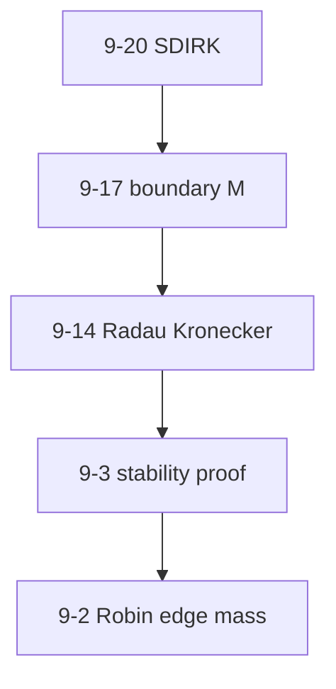

# Endterm Ch.9 — Homework Walkthrough

Priority homework for endterm prep, aligned with `NPDEFL_Problems.pdf` solutions and [[Parabolic-Timestepping-Problems]].

---

## Priority tier 1 (do before endterm)

### Problem 9-20 — MOL with SDIRK (`MOLSDIRK` / NPDERepo `SDIRK`)

**Exam mirror:** **2025 Endterm 0-2**

| Step | Task | Recipe |
|------|------|--------|
| (a) | Strong form + BCs | Type B — Neumann if $\nabla u \cdot \mathbf{n} = 0$ |
| (b) | $\mathbf{M}$, $\mathbf{A}$ with $\sigma(\mathbf{x})$ | Type C — `ReactionDiffusionElementMatrixProvider(fe, mf_zero, mf_sigma)` for $\mathbf{M}$ |
| (c) | SDIRK-2 stages | Type D — $\zeta = 1-\sqrt{2}/2$ |
| (d) | Balanced refinement | Type F — $\tau \sim h$ for $p=q=2$ |

> [!example] HOW TO: (c) on paper
> 1. $\mathbf{M}\dot{\boldsymbol{\mu}} = -\mathbf{A}\boldsymbol{\mu}$.
> 2. Stage 1: $(\mathbf{M}+\zeta\tau\mathbf{A})\boldsymbol{\kappa}_1 = -\tau\mathbf{A}\boldsymbol{\mu}^{(k)}$.
> 3. Stage 2: same matrix, RHS involves $\boldsymbol{\kappa}_1$.
> 4. $\boldsymbol{\mu}^{(k+1)} = \boldsymbol{\mu}^{(k)} + b_1\boldsymbol{\kappa}_1 + b_2\boldsymbol{\kappa}_2$.

---

### Problem 9-17 — Scalar parabolic evolution (`ParabolicEvolutionAspects`)

> [!warning] Folder trap
> **Not** `SobolevEvolutionProblem` (that is Problem **9-12**). No NPDERepo coding folder for 9-17.

**Exam mirror:** **2024 Endterm 0-1**

| Step | Key point |
|------|-----------|
| (a) | Boundary mass → Laplace in $\Omega$, evolution on $\partial\Omega$ |
| (b) | Natural Neumann-type BCs |
| (c) | $\mathbf{M}_{ij} = \int_{\partial\Omega} b_i b_j$ — **codim 1** |
| (d) | Implicit Euler; discuss s.p.d. failure of $\mathbf{M}$, $\mathbf{A}$ |

> [!warning] Exam trap
> Interior DOFs have zero rows in $\mathbf{M}$ — matrix is not invertible without considering structural rank.

---

### Problem 9-14 — Radau Kronecker (theory)

**Exam mirror:** **2023 Endterm 0-3**

| Step | Key point |
|------|-----------|
| (a) | $\mathbf{M}_{ij} = \int \rho b_i b_j$, $\mathbf{A}_{ij} = \int \nabla b_i \cdot \nabla b_j$ |
| (b) | Full $2N \times 2N$ Kronecker system — **not** SDIRK |

Full Butcher matrix in [[Parabolic-Timestepping-Problems#Problem 9-14]].

---

### Problem 9-3 — Implicit Euler stability (theory)

**Exam mirror:** **2022 Endterm 0-3** (discrete energy)

| Step | Key point |
|------|-----------|
| (a)–(b) | Modified bilinear form $\tilde{a} = a - \gamma m$ |
| (c)–(d) | Diagonalize $\mathbf{A}\mathbf{T} = \mathbf{M}\mathbf{T}\mathbf{D}$ |
| (e)–(h) | Prove $\|\boldsymbol{\mu}^{(j)}\|_{\mathbf{M}} \leq (1+\gamma\tau)^{-1}\|\boldsymbol{\mu}^{(j-1)}\|_{\mathbf{M}}$ |

> [!tip] Template proof
> Works for **any** implicit RK whose stability function satisfies $|R(\tau\lambda)| \leq 1$ on spectrum — specialize to implicit Euler.

---

## Priority tier 2 (solidify)

### Problem 9-2 — SDIRK + Robin BC (`SDIRKMethodOfLines`)

- Robin → edge mass in $\mathbf{A}$ via `MassEdgeMatrixProvider` / custom edge provider.
- Same SDIRK-2 decoupling as 9-20.
- Element matrices (b–f): Type E practice.

### Problem 9-1 — Radau-3 full implementation (`RadauThreeTimestepping`)

- Kronecker $2N \times 2N$ — must solve coupled system.
- Contrast with SDIRK in [[Endterm-Ch9-Student-Handout#Comparison: SDIRK vs Radau]].

### Problem 9-11 — Gauss-Lobatto IIIC (`GaussLobattoParabolic`)

- Supplementary (2020 Summer 0-3 style, not recent endterm).
- Useful for Kronecker practice with different $\mathcal{A}$.

---

## Priority tier 3 (time permitting)

| Problem | Topic |
|---------|-------|
| 9-21 | Extended MOL with constraint (DAE structure) |
| 9-22 | Nonlinear radiation BC + Newton |
| 9-23 | Full pipeline (`CSEMug`) |

Not endterm-critical — skip if time limited.

---

## Suggested study order

**Time budget:** ~6 h tier 1, ~4 h tier 2.

---

## Solution source locations

| Problem | PDF | Repo folder |
|---------|-----|-------------|
| 9-20 | `NPDEFL_Problems.pdf` | `MOLSDIRK` → NPDERepo `SDIRK` |
| 9-17 | same | `ParabolicEvolutionAspects` (no NPDERepo folder) |
| 9-14 | same | — (theory) |
| 9-3 | same | — |
| 9-2 | same | `SDIRKMethodOfLines` |
| 9-1 | same | `RadauThreeTimestepping` |

---

**Navigation:** [[Endterm-Ch9-Exam-Compendium]] | [[Parabolic-Timestepping-Problems]] | [[Endterm-Code-Cheatsheet]]
