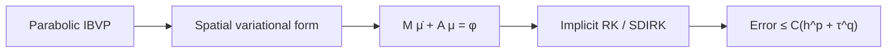

# Endterm Ch.9 — Student Handout (Parabolic / MOL)

**Chapter 9 §9.2** — spatial form → MOL → implicit timestepping → convergence

Related: [[Week-07-Parabolic-IBVPs]], [[Formulas-Timestepping]], [[Parabolic-Timestepping-Problems]]

---

## Core pipeline

---

## Spatial variational form

Seek $u:]0,T[ \to V$ such that for all $v \in V_0$:
$$m(\dot{u}(t), v) + a(u(t), v) = \ell(t)(v), \qquad u(0) = u_0$$

| Form | Standard heat | Exam trap |
|------|---------------|-----------|
| $m(u,v)$ | $\int_\Omega \rho u v$ | $\int_{\partial\Omega} \dot{u} v\,\mathrm{d}S$ **(2024 Endterm)** |
| $a(u,v)$ | $\int_\Omega \kappa \nabla u \cdot \nabla v$ | $+ c\int_{\partial\Omega} uv\,\mathrm{d}S$ (Robin) |
| $\ell(v)$ | $\int_\Omega f v$ | may be zero |

> [!tip] KEY: BC placement
> - Dirichlet → essential subspace $H^1_0$
> - Neumann → natural (no boundary term in $a$)
> - Robin → **adds to $a$** (edge integral)
> - Boundary time derivative → **$\mathbf{M}$ on $\partial\Omega$**

---

## Method of lines

$$u_h = \sum_{j=1}^N \mu_j(t)\, b_j^h \in S_p^0(\mathcal{M})$$
$$\mathbf{M}\dot{\boldsymbol{\mu}} + \mathbf{A}\boldsymbol{\mu} = \boldsymbol{\varphi}(t)$$

$$(\mathbf{M})_{ij} = m(b_j^h, b_i^h), \quad (\mathbf{A})_{ij} = a(b_j^h, b_i^h), \quad (\boldsymbol{\varphi})_i = \ell(t)(b_i^h)$$

> [!example] HOW TO: Identify M and A
> 1. Write $m$, $a$ from variational form.
> 2. Substitute basis functions for trial and test.
> 3. Check codim: volume → 0, boundary → 1.

---

## Timestepping schemes

| Scheme         | Fully discrete                                                                                                           | Order | Notes                                               |
| -------------- | ------------------------------------------------------------------------------------------------------------------------ | ----- | --------------------------------------------------- |
| Implicit Euler | $(\mathbf{M}+\tau\mathbf{A})\boldsymbol{\mu}^{(j)} = \mathbf{M}\boldsymbol{\mu}^{(j-1)} + \tau\boldsymbol{\varphi}(t_j)$ | 1     | $L(\pi)$-stable                                     |
| SDIRK-2        | $(\mathbf{M}+\zeta\tau\mathbf{A})\boldsymbol{\kappa}_i = \text{stage RHS}$                                               | 2     | $\zeta = 1-\sqrt{2}/2$; **same matrix both stages** |
| Radau-3        | Kronecker $2N \times 2N$                                                                                                 | 3     | **Not** SDIRK — coupled system                      |

> [!example] HOW TO: SDIRK-2 on MOL (2025 Endterm style)
> 1. Homogeneous: $\mathbf{M}\dot{\boldsymbol{\mu}} = -\mathbf{A}\boldsymbol{\mu}$.
> 2. Stage $i$: multiply RK equation by $\mathbf{M}$.
> 3. Solve with $\mathbf{S} = \mathbf{M} + \zeta\tau\mathbf{A}$ (factorize once).
> 4. Update with Butcher weights $b_1, b_2$.

**Stiffness:** $\lambda_{\max} = O(h^{-2})$ → explicit Euler: $\tau = O(h^2)$.

---

## Convergence (Meta-Thm 9.2.8.5)

$$\text{error} \leq C(h^p + \tau^q)$$

| FEM | RK | $H^1$ balance | Example |
|-----|-----|---------------|---------|
| $p=1$ | $q=2$ | $\tau \sim h^{1/2}$ | linear + SDIRK-2 |
| $p=2$ | $q=2$ | $\tau \sim h$ | quadratic + SDIRK-2 (**2025 0-2**) |

---

## Exam ↔ homework map

| Endterm | Points focus | Drill HW |
|---------|--------------|----------|
| **2025 0-2** | MOL + SDIRK + balance | **9-20** |
| **2024 0-1** | Boundary $\mathbf{M}$ | **9-17** |
| **2023 0-3** | Radau Kronecker | **9-14** |
| **2022 0-3** | Degenerate parabolic | **9-17**, **9-3** |

Details: [[Endterm-Ch9-Exam-Compendium]].

---

## Comparison: SDIRK vs Radau

| | SDIRK-2 | 2-stage Radau-3 |
|---|---------|-----------------|
| System size per step | $N \times N$ (×2 solves) | $2N \times 2N$ (×1 solve) |
| Same stage matrix? | Yes | No (full $\mathcal{A}$) |
| Order | 2 | 3 |
| $L(\pi)$-stable? | Yes | Yes |

---

## Practice exercises

1. **(2024-style, 8 pts)** Variational form with $\int_{\partial\Omega} \dot{u} v\,\mathrm{d}S + \int_\Omega \nabla u \cdot \nabla v = 0$. Give $\mathbf{M}_{ij}$, $\mathbf{A}_{ij}$ for $S_2^0(\mathcal{M})$. Recover strong PDE.
2. **(2025-style, 6 pts)** $\int_\Omega \sigma(\mathbf{x}) \dot{u} v + \int_\Omega \nabla u \cdot \nabla v = 0$, Neumann. Write MOL. SDIRK-2 stage equations.
3. **(Theory, 5 pts)** Prove $\|\boldsymbol{\mu}^{(j)}\|_{\mathbf{M}} \leq \|\boldsymbol{\mu}^{(j-1)}\|_{\mathbf{M}}$ for implicit Euler (sketch via diagonalization).
4. **(Radau, 8 pts)** Write $2N \times 2N$ Kronecker system for Radau-3 Butcher matrix applied to $\mathbf{M}\dot{\boldsymbol{\mu}} = -\mathbf{A}\boldsymbol{\mu}$.
5. **(Balance, 4 pts)** $S_2^0$ + SDIRK-2, target 100× error reduction in $H^1$ — how many mesh refinements if $h$ halved each time?
6. **(Robin, 6 pts)** Heat with $-\nabla u \cdot \mathbf{n} = c u$. Spatial form and which matrix gets edge contribution.
7. **(Stability, 4 pts)** Stability function of implicit Euler applied to $\dot{y} = \lambda y$, $\lambda < 0$.
8. **(Mixed, 10 pts)** Combine (1) and (2): identify which exam type (A–D) each subpart is.

> [!danger] Exam tags
> Q1 → 2024 0-1 | Q2 → 2025 0-2 | Q4 → 2023 0-3 | Q3 → HW 9-3

---

## Self-check

1. State MOL ODE symbolically.
2. Robin BC: $\mathbf{M}$ or $\mathbf{A}$?
3. SDIRK-2: value of $\zeta$?
4. How many solves per step with one factorization?
5. Strong form for 2024 Endterm boundary-mass problem?
6. Meta-theorem bound for $p=2$, $q=2$?
7. Why explicit Euler fails for fine meshes?
8. Radau-3: size of linear system?
9. Neumann BC for Laplacian: boundary term in $a$?
10. Weighted mass $\sigma(\mathbf{x})$: which bilinear form?

**Answers:** [[Endterm-Practice-Set#Ch.9 self-check answers]]

---

**Navigation:** [[Endterm-Prep-Ch9-Ch12]] | [[Endterm-Problem-Types-Recipes]] | [[Endterm-Ch9-Homework-Walkthrough]]
