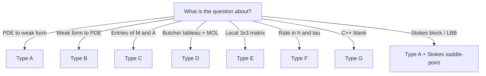

# Endterm Problem Types — Recipes (Ch.9 & Ch.12)

Exam task taxonomy adapted from the course standard types **A–G**, scoped to parabolic evolution and Stokes. Each recipe is a repeatable exam workflow.

---

## Type A — Derive weak form from PDE

**When:** Parabolic IBVP or Stokes strong form given.

> [!example] HOW TO: Type A (parabolic)
> 1. Write trial space $u(t) \in V$ (usually $H^1_0$ for Dirichlet; $H^1$ if only Neumann/natural BCs).
> 2. Multiply PDE by test $v \in V_0$ (spatial only — no $t$ in test functions).
> 3. Integrate over $\Omega$; integrate by parts on spatial derivatives (Green Thm 1.5.2.7).
> 4. Identify $m(\dot{u},v)$, $a(u,v)$, $\ell(t)(v)$ from remaining terms.
> 5. Classify BCs: essential → restrict $V$; natural → no boundary term; Robin → boundary integral in $a$.
> 6. State IC: $u(0) = u_0$.

> [!example] HOW TO: Type A (Stokes)
> 1. Test momentum with $\mathbf{w} \in (H^1_0(\Omega))^d$.
> 2. IBP on $-\mu\Delta\mathbf{v}$ → $\int \mu D\mathbf{v}:D\mathbf{w}$.
> 3. IBP on $\nabla p$ → $-\int p\,\mathrm{div}\,\mathbf{w}$ (boundary terms vanish for no-slip).
> 4. Test $\mathrm{div}\,\mathbf{v} = 0$ with $q \in L^2(\Omega)$ → $b(\mathbf{v},q) = -\int q\,\mathrm{div}\,\mathbf{v}$.
> 5. Pin pressure: $\int_\Omega p = 0$ or Lagrange multiplier $\lambda$.

**Ch.9 examples:** 2024 Endterm 0-1 (given variational form — verify understanding); HW 9-2(a), 9-20(a).

**Ch.12 examples:** 2025 Endterm 0-1(a) — fill boxes in saddle-point form (12.2.2.44).

---

## Type B — Recover PDE from weak form

**When:** Variational form given; find strong PDE + BCs.

> [!example] HOW TO: Type B
> 1. Assume $u$ smooth enough for IBP in reverse direction.
> 2. Apply fundamental lemma (1.5.3.4) to interior terms → strong PDE in $\Omega$.
> 3. Read boundary terms from integration by parts → classify natural vs essential BCs.
> 4. Check sign of divergence/gradient terms carefully.

**Ch.9 examples:** 2024 Endterm 0-1 (strong form is $-\Delta u = 0$ in $\Omega$, evolution on $\partial\Omega$); HW 9-17(a).

**Ch.12 examples:** Recover (12.2.3.5) from saddle-point form — standard exercise.

---

## Type C — MOL matrix entries

**When:** Spatial variational form + FEM space given; write $\mathbf{M}$, $\mathbf{A}$, $\boldsymbol{\varphi}$.

> [!example] HOW TO: Type C
> 1. Expand $u_h = \sum_j \mu_j(t)\, b_j^h$, $\dot{u}_h = \sum_j \dot{\mu}_j(t)\, b_j^h$.
> 2. Substitute into $m(\dot{u}, v) + a(u,v) = \ell(v)$.
> 3. Read off $(\mathbf{M})_{ij} = m(b_j^h, b_i^h)$, $(\mathbf{A})_{ij} = a(b_j^h, b_i^h)$, $(\boldsymbol{\varphi})_i = \ell(b_i^h)$.
> 4. **Codim check:** boundary integrals → assemble with `AssembleMatrixLocally(1, ...)` (codim 1).
> 5. Volume integrals → codim 0.

> [!warning] CAUTION
> Robin BC: edge term in **$\mathbf{A}$**, not $\mathbf{M}$. Weighted $\sigma(\mathbf{x})$: factor in **$\mathbf{M}$** only.

**Ch.9 examples:** 2024 Endterm 0-1(a); 2025 Endterm 0-2(b); HW 9-14(a), 9-20(b).

---

## Type D — Apply RK to MOL ODE

**When:** Butcher tableau + MOL system given; write fully discrete scheme.

> [!example] HOW TO: Type D
> 1. Start from MOL: $\mathbf{M}\dot{\boldsymbol{\mu}} = -\mathbf{A}\boldsymbol{\mu} + \boldsymbol{\varphi}(t)$ (homogeneous if $\boldsymbol{\varphi} \equiv 0$).
> 2. Write RK stage equations (Rem. 7.3.3.6): $\mathbf{M}\boldsymbol{\kappa}_i = \tau f(\boldsymbol{\mu}^{(k)} + \sum_j a_{ij}\boldsymbol{\kappa}_j)$.
> 3. Substitute $f(\boldsymbol{\mu}) = -\mathbf{M}^{-1}\mathbf{A}\boldsymbol{\mu} + \mathbf{M}^{-1}\boldsymbol{\varphi}$.
> 4. **Multiply by $\mathbf{M}$** to clear $\mathbf{M}^{-1}$.
> 5. For **SDIRK-2** (Ex. 9.2.7.49): $\zeta = 1 - \sqrt{2}/2$; both stages use $\mathbf{M} + \zeta\tau\mathbf{A}$ → factorize once.
> 6. For **non-SDIRK** (Radau-3): full $(\mathbf{I}_s \otimes \mathbf{M} + \tau\mathcal{A} \otimes \mathbf{A})$ system — $2N \times 2N$.

**Ch.9 examples:** 2025 Endterm 0-2(c); 2023 Endterm 0-3; HW 9-20(c), 9-14(b).

---

## Type E — Element matrix entries

**When:** Local shape functions on reference triangle; fill mass/stiffness blocks.

> [!example] HOW TO: Type E
> 1. Identify local basis on $K$ (linear: 3 DOFs; quadratic: 6 DOFs).
> 2. Use Lemma 2.7.5.5 for $\int_K \nabla b_i \cdot \nabla b_j$ on linear elements.
> 3. Mass on triangle: $|K|/12$ times the standard $3\times 3$ pattern for $P_1$.
> 4. Edge mass (Robin): $|e|/6 \times \begin{pmatrix}2&1\\1&2\end{pmatrix}$ for $P_1$ on edge $e$.

**Endterm frequency:** LOW on recent endterms; HIGH on midterms / HW 9-2(b–f).

---

## Type F — Predict convergence rates

**When:** FEM degree $p$, RK order $q$, norm specified ($H^1$ vs $L^2$).

> [!example] HOW TO: Type F
> 1. Spatial rate from Thm 3.3.2.21 / meta-thm 9.2.8.5: $O(h^p)$ in $H^1$, $O(h^{p+1})$ in $L^2$ for elliptic part.
> 2. Temporal rate: $O(\tau^q)$ from RK order (if $L(\pi)$-stable).
> 3. Total: $\text{error} \leq C(h^p + \tau^q)$.
> 4. **Balance:** set $\tau \sim h^{p/q}$ to equilibrate contributions.
> 5. For $p=2$, $q=2$, $H^1$ norm: $\tau \sim h$.

**Ch.9 examples:** 2025 Endterm 0-2(d); HW 9-20(d).

**Ch.12 examples:** Taylor-Hood: $\|\mathbf{u}-\mathbf{u}_h\|_{H^1} = O(h^2)$, $\|p-p_h\|_{L^2} = O(h^2)$ under smooth solution (Thm 12.3.3.13).

---

## Type G — LehrFEM code blanks

**When:** Implementation snippet with missing lines (more common on **summer finals** than endterm).

> [!example] HOW TO: Type G
> 1. Read surrounding assembly loop — identify bilinear form being discretized.
> 2. Match to mathematical formula ($a$, $b$, mass, stiffness).
> 3. Use correct provider: `ReactionDiffusionElementMatrixProvider`, `MassEdgeMatrixProvider`, etc.
> 4. Minimal correct line — no extra logic.

**Endterm:** rare. **Summer final:** Taylor-Hood (`StokesPipeFlow`), MINI, stabilized P1. See [[Endterm-Code-Cheatsheet]].

---

## Quick decision tree

---

**Navigation:** [[Endterm-Prep-Ch9-Ch12]] | [[Endterm-Ch9-Exam-Compendium]] | [[Endterm-Ch12-Exam-Compendium]] | [[Formulas-Timestepping]] | [[Formulas-Stokes]]
