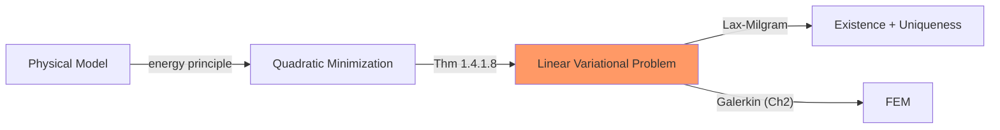

# Week 1 — Elliptic BVPs I

**Sections:** §1.2–§1.4 | **Chapter 1: Second-Order Scalar Elliptic Boundary Value Problems**

---

## Overview

This week introduces the continuous theory that underpins all of FEM. Physical models — [[Elastic-Membrane-Model]], [[Electrostatic-Field-Model]] — lead to second-order elliptic PDEs. The key abstraction: every such PDE is equivalent to minimizing a [[Quadratic-Minimization-Problem|quadratic energy functional]] (card: [[Quadratic-Minimization-Problem]]), which is equivalent to a [[Linear-Variational-Problem]]. [[Sobolev-Spaces]] provide the correct function space setting. The [[Lax-Milgram-Theorem]] guarantees existence and uniqueness.

---

## Theory Gist

### §1.2 — Elastic Membranes and Strings

> [!info] Model PDEs
> **1D string:** $-u''(x) = f(x)$ on $]a,b[$, $u(a) = u(b) = 0$
> **2D membrane:** $-\Delta u = f$ in $\Omega$, $u = 0$ on $\partial\Omega$
> **Dirichlet principle:** the solution minimizes total potential energy
> $$J(u) = \frac{1}{2}\int_\Omega |\nabla u|^2\,\mathrm{d}\mathbf{x} - \int_\Omega f\,u\,\mathrm{d}\mathbf{x}$$

With spatially varying material: $-\operatorname{div}(\kappa\,\nabla u) = f$ (electrostatics, heat conduction). Same structure, coefficient $\kappa(\mathbf{x})$ in the energy.

### §1.3 — Sobolev Spaces

Function spaces for variational problems:

| Space | Contains | Norm |
|-------|----------|------|
| $H^1(\Omega)$ | Functions with square-integrable weak gradient | $\|u\|_{H^1}^2 = \|u\|_{L^2}^2 + \|\nabla u\|_{L^2}^2$ |
| $H_0^1(\Omega)$ | $H^1$ functions with zero trace on $\partial\Omega$ | Same |

**Poincaré-Friedrichs inequality (Thm 1.3.4.17):** On $H_0^1(\Omega)$: $\|u\|_{L^2} \leq \mathrm{diam}(\Omega)\,\|\nabla u\|_{L^2}$.

This means the seminorm $|u|_{H^1} = \|\nabla u\|_{L^2}$ is a full norm on $H_0^1$.

### §1.2.3 — [[Quadratic-Minimization-Problem|Quadratic Minimization]] ↔ Variational Problem

> [!theorem] Thm 1.4.1.8 — Equivalence
> For symmetric positive definite bilinear form $a$:
> $$u^* = \arg\min_v \left[\frac{1}{2}a(v,v) - \ell(v)\right] \quad \Longleftrightarrow \quad a(u^*,v) = \ell(v) \;\;\forall v \in V_0$$

### §1.4 — Lax-Milgram Theorem

> [!theorem] Lax-Milgram
> If $a$ is **continuous** ($|a(u,v)| \leq C_a\|u\|\|v\|$) and **coercive** ($a(v,v) \geq \alpha\|v\|^2$), and $\ell$ is continuous, then the variational problem has a **unique solution** with $\|u\| \leq C_\ell/\alpha$.

Coercivity is the hard condition. For $a(u,v) = \int \nabla u \cdot \nabla v$ on $H_0^1$: follows from Poincaré-Friedrichs.

---

## Method Recipes

### Recipe 1: Identify the variational structure of an energy functional

1. Given energy $J(u) = \frac{1}{2}\int \ldots - \int \ldots$
2. Extract the **bilinear** part $\to a(u,v)$ and the **linear** part $\to \ell(v)$
3. Check: is $a$ symmetric? positive definite?
4. Write the variational problem: find $u \in V$: $a(u,v) = \ell(v) \;\forall v \in V_0$

### Recipe 2: Check Lax-Milgram conditions

1. **Continuity of $a$:** use Cauchy-Schwarz: $|a(u,v)| = |\int \nabla u \cdot \nabla v| \leq \|\nabla u\|_0\|\nabla v\|_0 \leq \|u\|_{H^1}\|v\|_{H^1}$
2. **Coercivity of $a$:** for Dirichlet problems, use Poincaré-Friedrichs: $a(u,u) = \|\nabla u\|_0^2 = |u|_{H^1}^2 \geq C\,\|u\|_{H^1}^2$
3. **Continuity of $\ell$:** use Cauchy-Schwarz: $|\ell(v)| = |\int f\,v| \leq \|f\|_0\|v\|_0$

### Recipe 3: Compute Sobolev norms

1. $\|u\|_{L^2}^2 = \int_\Omega |u|^2\,\mathrm{d}\mathbf{x}$
2. $|u|_{H^1}^2 = \int_\Omega |\nabla u|^2\,\mathrm{d}\mathbf{x}$ (in 1D: $\int (u')^2\,dx$)
3. $\|u\|_{H^1}^2 = \|u\|_{L^2}^2 + |u|_{H^1}^2$
4. On $H_0^1$: the seminorm $|u|_{H^1}$ suffices (equivalent to full norm by Poincaré)

---

## Homework Problems

> [[Elliptic-BVP-Theory-Problems]]

| Problem | Title | Key skills |
|---------|-------|------------|
| **1-1** | Quadratic Functionals | Identify $a$, $\ell$ from energy, check positive definiteness |
| **1-2** | Linear Functionals on Sobolev Spaces | Continuity proofs, trace inequality |
| **1-3** | $L^\infty$ Bounded by $H^1$-Seminorm (1D) | Sobolev embedding, fundamental theorem of calculus |
| **1-4** | Poincaré-Type Inequality | Poincaré-Friedrichs variants |

> Norms: [[Formulas-Sobolev-Norms]]

---

## Exam Problems

> Full bank: [[Exam-Master-Bank#Ch1]] | Hub: [[Exam-Prep-Index]]

| Year | Exam | Problem | Topic | HW / note |
|------|------|---------|-------|-----------|
| **2026** | Midterm | 0-1 | Reformulating a Second-Order Elliptic Variational … | 1-10 VP_BVP_MP; [[Exam-Deep-Elliptic-Weak-Form]] |
| **2025** | Final (Winter) | 1-1 | Axisymmetric Boundary Value Problem | — AxisymmetricBVP |
| **2023** | Midterm | 0-1 | From Boundary Value Problems to Variational Proble… | 1-10 VPtoBVP; [[Exam-Deep-Elliptic-Weak-Form]] |
| **2023** | Final (Winter) | 1-2 | Coupled Elliptic Boundary Value Problems | — CoupledBVPs |
| **2023** | Final (Summer) | 1-1 | Solving a Semi-Linear Elliptic Boundary Value Prob… | — SemilinearEllipticBVP |
| **2023** | Endterm | 0-2 | Iterative Methods for Non-Linear Variational Probl… | — [[Exam-Deep-Elliptic-Weak-Form]] |
| **2022** | Midterm | 0-1 | Boundary-value problems, variational problems, and… | — [[Exam-Deep-Elliptic-Weak-Form]] |
| **2021** | Midterm | 0-1 | Second-order Elliptic BVP from weak formulations | — [[Exam-Deep-Elliptic-Weak-Form]] |
| **2021** | Final (Winter) | 1-3 | Nitsche’s Method for Elliptic BVPs | — — |
| **2021** | Final (Summer) | 1-2 | The Sobolev Evolution Initial-Boundary Value Probl… | — — |
| **2019** | Midterm | 0-1 | Deducing the strong form of second-order elliptic … | — — |
| **2019** | Final (Summer) | 0-3 | A mixed elliptic-hyperbolic linear evolution probl… | — — |
| **2019** | Final (Summer) | 0-2 | Output Functionals for a 2nd-Order Elliptic Bounda… | — — |
| **2019** | Endterm | 0-2 | Variational Crimes in Finite-Element Galerkin Disc… | — [[Exam-Deep-Elliptic-Weak-Form]] |

---

## Connections

| This week | Builds on | Feeds into |
|-----------|-----------|------------|
| Quadratic minimization | Calculus, linear algebra | [[Week-02-Elliptic-BVPs-II]] (BCs, more models) |
| Sobolev spaces | Measure theory (informal) | [[Week-07-Parabolic-IBVPs]] ($H_0^1$ test space in parabolic variational form) |
| Lax-Milgram | Hilbert space theory | [[Week-03-FEM-I]] (Galerkin = Lax-Milgram on $V_h$) |
| Variational problems | — | [[Week-07-Parabolic-IBVPs]] (same $a(\cdot,\cdot)$, $m(\cdot,\cdot)$ structure) |

---

## Exam Checklist

- [ ] Given an energy functional $J(u)$, extract $a(\cdot,\cdot)$ and $\ell(\cdot)$
- [ ] Compute $H^1$ norm and seminorm for specific functions
- [ ] State and apply the Poincaré-Friedrichs inequality
- [ ] Verify Lax-Milgram conditions (coercivity + continuity)
- [ ] Write down the variational problem for a given PDE + BCs
