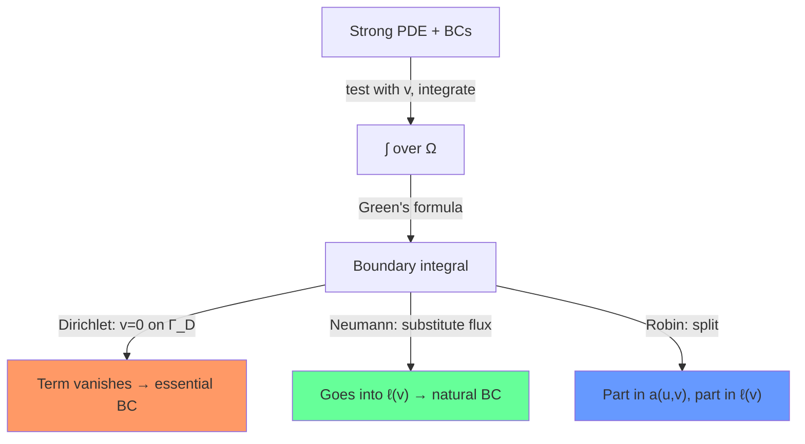

# Week 2 — Elliptic BVPs II

**Sections:** §1.5–§1.9 | **Chapter 1: Second-Order Scalar Elliptic Boundary Value Problems**

---

## Overview

This week expands the modeling toolkit and tackles the critical practical topic: how [[Boundary-Conditions-Elliptic|boundary conditions]] enter the variational formulation (card: [[Boundary-Conditions-Elliptic]]). Equilibrium models and diffusion models all lead to $-\operatorname{div}(\kappa\nabla u) = f$. The key distinction: **essential BCs** (Dirichlet) are built into the function space, **natural BCs** (Neumann, Robin) emerge from integration by parts — see [[Essential-vs-Natural-BCs]]. Mastering this distinction is the single most tested skill on midterms.

---

## Theory Gist

### §1.5 — Equilibrium Models and Green's Formula

Physical models (force balance, energy conservation) lead to BVPs. The key mathematical tool:

> [!theorem] Green's First Formula (Thm 1.5.2.7)
> $$\int_\Omega (-\Delta u)\,v\,\mathrm{d}\mathbf{x} = \int_\Omega \nabla u \cdot \nabla v\,\mathrm{d}\mathbf{x} - \int_{\partial\Omega} (\nabla u \cdot \mathbf{n})\,v\,\mathrm{d}S$$

This is integration by parts in $d$ dimensions. The boundary integral is where natural BCs enter.

**Gauss' theorem (Thm 1.5.2.4):** $\int_\Omega \operatorname{div}\mathbf{F}\,\mathrm{d}\mathbf{x} = \int_{\partial\Omega} \mathbf{F} \cdot \mathbf{n}\,\mathrm{d}S$ (prerequisite for Green).

### §1.6 — Diffusion Models

All lead to the same PDE: $-\operatorname{div}(\kappa\,\nabla u) = f$.

| Physical model | $u$ | $\kappa$ |
|---------------|-----|----------|
| Heat conduction | Temperature | Thermal conductivity |
| Electrostatics | Potential $\phi$ | Permittivity $\epsilon$ |
| Darcy flow | Pressure head | Hydraulic conductivity |

### §1.7 — [[Boundary-Conditions-Elliptic|Boundary Conditions]]

| Type          | Condition                                                | Effect on variational form                                                                                                          |
| ------------- | -------------------------------------------------------- | ----------------------------------------------------------------------------------------------------------------------------------- |
| **Dirichlet** | $u = g$ on $\Gamma_D$                                    | Trial space: $V = \{v \in H^1 : v_{\Gamma_D} = g\}$, test: $V_0 = \{v : v_{\Gamma_D} = 0\}$                                         |
| **Neumann**   | $\kappa\nabla u \cdot \mathbf{n} = h$ on $\Gamma_N$      | Load: $\ell(v) \mathrel{+}= \int_{\Gamma_N} h\,v\,\mathrm{d}S$                                                                      |
| **Robin**     | $\kappa\nabla u \cdot \mathbf{n} + cu = h$ on $\Gamma_R$ | Stiffness: $a(u,v) \mathrel{+}= c\int_{\Gamma_R} u\,v\,\mathrm{d}S$; load: $\ell(v) \mathrel{+}= \int_{\Gamma_R} h\,v\,\mathrm{d}S$ |

### §1.8–§1.9 — General Elliptic Variational Problem & Essential vs Natural BCs

> [!warning] The classification rule
> - **Essential** = condition on $u$ → restrict the space (Dirichlet)
> - **Natural** = condition on flux $\nabla u \cdot \mathbf{n}$ → falls out of Green's formula
> - If you impose **nothing** on a boundary segment → homogeneous Neumann ($\nabla u \cdot \mathbf{n} = 0$) by default and thus need to ensure zero mean for uniqueness

---

## Method Recipes

### Recipe 1: Derive variational form from strong PDE with BCs

1. Start with PDE: e.g., $-\operatorname{div}(\kappa\nabla u) + cu = f$ in $\Omega$
2. Multiply by test function $v$ and integrate over $\Omega$
3. Apply Green's formula to the second-order term
4. Split boundary integral over $\Gamma_D$, $\Gamma_N$, $\Gamma_R$:
   - On $\Gamma_D$: $v = 0$ → integral vanishes
   - On $\Gamma_N$: substitute $\kappa\nabla u \cdot \mathbf{n} = h$ → moves to $\ell(v)$
   - On $\Gamma_R$: substitute $\kappa\nabla u \cdot \mathbf{n} = h - cu$ → split between $a$ and $\ell$
5. Read off $a(u,v)$, $\ell(v)$, trial space $V$, test space $V_0$

### Recipe 2: Classify BCs as essential or natural

Ask: **does this condition restrict the function value of $u$?**
- Yes (e.g., $u = g$) → **essential** → built into space
- No (e.g., $\nabla u \cdot \mathbf{n} = h$) → **natural** → handled by the variational form

### Recipe 3: Handle inhomogeneous Dirichlet BCs

1. Choose a **lifting** $u_g \in H^1(\Omega)$ with $u_g|_{\Gamma_D} = g$
2. Write $u = u_0 + u_g$ with $u_0 \in H_0^1(\Omega)$
3. Solve for $u_0$: $a(u_0, v) = \ell(v) - a(u_g, v)$ for all $v \in H_0^1$

---

## Homework Problems

> [[Elliptic-BVP-Theory-Problems]]

| Problem | Title | Key skills |
|---------|-------|------------|
| **1-5** | Transmission Problem in 1D | Strong ↔ weak with discontinuous $\kappa$ |
| **1-6** | Heat Conduction with Non-Local BCs | Non-standard variational formulation |
| **1-7** | BVP for Vector Fields | Vector-valued variational problems |
| **1-8** | Coupled Reaction-Diffusion | Systems, coercivity on product spaces |
| **1-9** | Elliptic BVP from Weak Formulations | Reverse: variational → strong form + BCs |
| **1-10** | From BVPs to Variational Problems | Forward: strong form → variational (exam template!) |
| **1-11** | Strong and Weak Form of Elliptic BVPs | Both directions, all BC types |

---

## Exam Problems

> Full bank: [[Exam-Master-Bank#Ch1]] | Hub: [[Exam-Prep-Index]]

| Year | Exam | Problem | Topic | HW / note |
|------|------|---------|-------|-----------|
| **2026** | Midterm | 0-1 | Reformulating a Second-Order Elliptic Variational … | 1-10 VP_BVP_MP; [[Exam-Deep-Elliptic-Weak-Form]] |
| **2025** | Final (Winter) | 1-1 | Axisymmetric Boundary Value Problem | — AxisymmetricBVP |
| **2023** | Midterm | 0-1 | From Boundary Value Problems to Variational Proble… | 1-10 VPtoBVP; [[Exam-Deep-Elliptic-Weak-Form]] |
| **2023** | Final (Winter) | 1-2 | Coupled Elliptic Boundary Value Problems | — CoupledBVPs |
| **2023** | Final (Summer) | 1-1 | Solving a Semi-Linear Elliptic Boundary Value Prob… | — SemilinearEllipticBVP |
| **2023** | Endterm | 0-2 | Iterative Methods for Non-Linear Variational Probl… | — [[Exam-Deep-Elliptic-Weak-Form]] |
| **2022** | Midterm | 0-1 | Boundary-value problems, variational problems, and… | — [[Exam-Deep-Elliptic-Weak-Form]] |
| **2021** | Midterm | 0-1 | Second-order Elliptic BVP from weak formulations | — [[Exam-Deep-Elliptic-Weak-Form]] |
| **2021** | Final (Winter) | 1-3 | Nitsche’s Method for Elliptic BVPs | — — |
| **2021** | Final (Summer) | 1-2 | The Sobolev Evolution Initial-Boundary Value Probl… | — — |
| **2019** | Midterm | 0-1 | Deducing the strong form of second-order elliptic … | — — |
| **2019** | Final (Summer) | 0-3 | A mixed elliptic-hyperbolic linear evolution probl… | — — |
| **2019** | Final (Summer) | 0-2 | Output Functionals for a 2nd-Order Elliptic Bounda… | — — |
| **2019** | Endterm | 0-2 | Variational Crimes in Finite-Element Galerkin Disc… | — [[Exam-Deep-Elliptic-Weak-Form]] |

---

## Connections

| This week | Builds on | Feeds into |
|-----------|-----------|------------|
| Green's formula | Gauss' theorem, calculus | Every variational derivation from now on |
| BC classification | [[Week-01-Elliptic-BVPs-I]] (variational framework) | [[Week-04-FEM-II]] ([[Essential-BC-Treatment]]) |
| Robin BCs | — | [[Week-07-Parabolic-IBVPs]] (Problem 9-2: Robin → edge mass in $\mathbf{A}$) |
| Diffusion model | — | [[Week-07-Parabolic-IBVPs]] (heat equation = time-dependent diffusion) |

---

## Exam Checklist

- [ ] Derive variational form from any PDE with Dirichlet/Neumann/Robin BCs
- [ ] Classify each BC as essential or natural
- [ ] Apply Green's formula correctly (know the boundary integral sign)
- [ ] Handle inhomogeneous Dirichlet via lifting/offset technique
- [ ] Know that "no BC" = homogeneous Neumann by default
- [ ] Check coercivity for Robin BCs (boundary integral helps!)
- [ ] Recognize pure Neumann as singular (compatibility condition needed)
