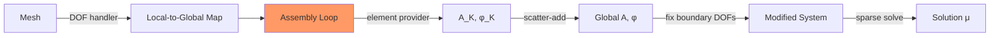

# Week 4 — Finite Element Methods II

**Sections:** §2.5–§2.7 | **Chapter 2: Finite Element Methods (FEM)**

---

## Overview

From specific examples (1D tent functions, 2D triangles) to the general FEM framework. [[Lagrangian-FEM]] of degree $p$, [[Mesh-Data-Structures]] in LehrFEM++, cell-oriented [[Assembly-Algorithm]], [[Local-Computations]] via reference elements, and [[Essential-BC-Treatment]]. Patterns: [[LehrFEM-Assembly-Patterns]], [[LehrFEM-Mesh-Patterns]], [[Formulas-FEM-Assembly]]. **Implementation week** — used in all LehrFEM++ homework from Ch9 onward.



---

## Theory Gist

### §2.5 — Finite Element Triple

> [!info] Finite Element Triple (§2.5)
> A finite element is a triple $(K, P_K, \Sigma_K)$:
> - $K$: element geometry (triangle, quad, ...)
> - $P_K$: local polynomial space (e.g., $\mathcal{P}_p$)
> - $\Sigma_K$: set of DOFs (functionals that uniquely determine $u \in P_K$)

**Unisolvence:** the DOF set $\Sigma_K$ must uniquely determine every function in $P_K$ — equivalent to the generalized Vandermonde matrix being invertible.

### §2.6 — Lagrangian FEM

DOFs = point evaluations at specific nodes. Global FE space:

$$\mathcal{S}_p^0(\mathcal{M}) = \{u \in C^0(\overline{\Omega}) : u|_K \in \mathcal{P}_p(K) \;\forall K \in \mathcal{M}\}$$

| Degree $p$ | Nodes/triangle | LehrFEM++ class |
|------------|----------------|----------------|
| 1 | 3 (vertices) | `FeSpaceLagrangeO1` |
| 2 | 6 (vertices + edge midpoints) | `FeSpaceLagrangeO2` |

### §2.7.1–2 — Mesh Data Structures

| Co-dim | Entity | LehrFEM++ |
|--------|--------|-----------|
| 0 | Cells (triangles/quads) | `mesh->Entities(0)` |
| 1 | Edges | `mesh->Entities(1)` |
| 2 | Nodes | `mesh->Entities(2)` |

Key class: `lf::mesh::Mesh` stores entities + incidence relations.

### §2.7.3 — DOF Handler

`lf::assemble::UniformFEDofHandler` manages local ↔ global DOF mapping. For $p=1$: 1 DOF per node. For $p=2$: 1 DOF per node + 1 per edge.

### §2.7.4 — Cell-Oriented Assembly

> [!info] Algorithm 2.7.4.20/23
> ```
> for each cell K:
>     A_K = provider.Eval(K)       // element matrix
>     for (i,j) in local DOFs:
>         A[global(i), global(j)] += A_K[i,j]
> ```
> LehrFEM++: `AssembleMatrixLocally(0, dofh, dofh, provider, A_COO)`

**Element matrix providers:**

| Provider | What it computes |
|----------|-----------------|
| `ReactionDiffusionElementMatrixProvider` | $\int_K \kappa\nabla b_i \cdot \nabla b_j + \int_K c\,b_i b_j$ |
| `MassEdgeMatrixProvider` | $\int_e b_i b_j\,\mathrm{d}S$ (boundary) |
| `ScalarLoadElementVectorProvider` | $\int_K f\,b_i$ |

### §2.7.5 — Local Computations

Reference element $\hat{K}$, affine map $\Phi_K: \hat{K} \to K$, Jacobian $\mathbf{F}_K = D\Phi_K$.

> [!theorem] Lemma 2.8.3.10 (§2.8.3) — Gradient transformation
> $$\nabla_{\mathbf{x}} u = \mathbf{F}_K^{-T}\,\nabla_{\hat{\mathbf{x}}}\hat{u}$$

Integrals: $\int_K g\,\mathrm{d}\mathbf{x} = |\det\mathbf{F}_K|\int_{\hat{K}} g \circ \Phi_K\,\mathrm{d}\hat{\mathbf{x}}$. Evaluate via quadrature on $\hat{K}$.

### §2.7.6 — Essential BC Treatment

> [!warning] Dirichlet BC enforcement
> After full assembly into `A_COO`, $\boldsymbol{\varphi}$: flag boundary DOFs, then call `FixFlaggedSolutionComponents()` to modify the system.
>
> LehrFEM++:
> 1. `auto bd = lf::mesh::utils::flagEntitiesOnBoundary(mesh_p);`
> 2. Create selector: `(dof on Γ_D) → {true, g(x)}`
> 3. `lf::assemble::FixFlaggedSolutionComponents<double>(selector, A_COO, phi);`

---

## Method Recipes

### Recipe 1: Full LehrFEM++ assembly pipeline

1. **Mesh:** load/generate via `MeshFactory` or `GmshReader`
2. **FE space:** `auto fe_space = std::make_shared<lf::uscalfe::FeSpaceLagrangeO1>(mesh_p);`
3. **DOF handler:** `auto& dofh = fe_space->LocGlobMap();`
4. **Stiffness matrix $\mathbf{A}$:**
   ```
   auto provider = ReactionDiffusionElementMatrixProvider(fe_space, mf_kappa, mf_zero);
   AssembleMatrixLocally(0, dofh, dofh, provider, A_COO);
   ```
5. **Mass matrix $\mathbf{M}$:** same with `(mf_zero, mf_rho)` arguments
6. **Load vector $\boldsymbol{\varphi}$:** `ScalarLoadElementVectorProvider` + `AssembleVectorLocally`
7. **Boundary terms:** add `MassEdgeMatrixProvider` for Robin BCs
8. **Essential BCs:** `FixFlaggedSolutionComponents<double>(selector, A_COO, phi)`
9. **Sparse conversion + solve:** `A = A_COO.makeSparse();` then `Eigen::SparseLU<...> solver; solver.compute(A); mu = solver.solve(phi);`

### Recipe 2: Compute element matrices on reference element

1. Map triangle $K$ to reference $\hat{K}$ via $\Phi_K^{-1}$
2. Compute $\mathbf{F}_K$ (Jacobian), $|\det\mathbf{F}_K| = 2|K|$
3. Transform gradients: $\nabla_x b_i = \mathbf{F}_K^{-T}\nabla_{\hat{x}} \hat{b}_i$
4. Integrate: $(\mathbf{A}_K)_{ij} = |\det\mathbf{F}_K|\int_{\hat{K}} (\mathbf{F}_K^{-T}\nabla\hat{b}_i) \cdot (\mathbf{F}_K^{-T}\nabla\hat{b}_j)\,\mathrm{d}\hat{\mathbf{x}}$
5. For linear FEM: gradients are constant → stiffness exact without quadrature

### Recipe 3: Handle essential BCs in LehrFEM++

1. Flag boundary DOFs: `flagEntitiesOnBoundary`
2. Define BC values: `g(x)` at each flagged DOF
3. Call `FixFlaggedSolutionComponents<double>(selector, A_COO, phi)` before sparse conversion — preserves symmetry
4. Solve the modified system

### Recipe 4: Choose FEM degree

| Situation | Degree | Why |
|-----------|--------|-----|
| Basic problems, coarse meshes | $p=1$ | Simplest, fewer DOFs |
| Better accuracy, moderate regularity | $p=2$ | Used in Problems 9-17, 9-20 |
| Smooth solutions, fast convergence | $p \geq 3$ | Spectral convergence possible |

---

## Homework Problems

> [[FEM-Assembly-Implementation-Problems]]

| Problem | Title | Code folder | Key skills |
|---------|-------|-------------|------------|
| **2-6** | Incidence Matrices of Hybrid 2D Mesh | `IncidenceMatrices` | Mesh topology, `Entity`, co-dimensions |
| **2-7** | Computing Boundary Length | `LengthOfBoundary` | Mesh iteration, boundary detection |
| **2-8** | Introduction to Local Assembly | `ElementMatrixComputation` | Custom element provider, `AssembleMatrixLocally` |
| **2-9** | Handling DOFs | `LFPPDofHandling` | `UniformFEDofHandler`, local↔global |
| **2-12** | Testing Quadrature Rules | `TestQuadratureRules` | `lf::quad` module |
| **2-13** | Parametric Element Matrices | `ParametricElementMatrices` | Reference element, Jacobian, quadrature |
| **2-14** | Crouzeix-Raviart FEM | `NonConformingCrouzeixRaviartFiniteElements` | Non-conforming, edge DOFs Also covered in Week 10 |
| **2-15** | Regularized Neumann Problem | `RegularizedNeumannProblem` | Singular matrix, constraint |
| **2-17** | Convection Bilinear Form | `ConvBLFMatrixProvider` | Non-symmetric element matrices Assembly practice before Week 8 |
| **2-20** | DofHandler and Assembly | `LFPPDofHandling` | Higher-order DOF handling |
| **2-24** | Parametric FEM Local Computations | `ParametricElementMatrices` | Curved elements, quadrature |

---

## Exam Problems

> Full bank: [[Exam-Master-Bank#Ch2]] | Hub: [[Exam-Prep-Index]]

| Year | Exam | Problem | Topic | HW / note |
|------|------|---------|-------|-----------|
| **2026** | Midterm | 0-3 | Quadratic Lagrangian Finite Element Method | 2-20 QuadLagrFEM |
| **2026** | Midterm | 0-2 | Element Matrix on a Curved Triangle | 2-13 ElementMatrixCurvedTriangle; [[Exam-Deep-Element-Matrices]] |
| **2023** | Midterm | 0-3 | DofHandler and Assembly | 2-20 DOFHandlerAssembly |
| **2023** | Midterm | 0-2 | Lagrangian Finite Elements on Criss-Cross Meshes | 2-19 FESpacesCrissCross; [[Exam-Deep-Element-Matrices]] |
| **2022** | Midterm | 0-3 | Sparsity of Galerkin matrices | — — |
| **2022** | Endterm | 0-1 | Finite-Volume Method/Finite-Difference Method on T… | — — |
| **2021** | Final (Summer) | 1-1 | Non-conforming Crouzeix-Raviart FEM: Theoretical a… | — — |
| **2019** | Midterm | 0-3 | Operating locally on Galerkin matrices | — — |
| **2019** | Midterm | 0-2 | Cubic Lagrangian finite element space on 2D hybrid… | — — |

---

## Connections

| This week | Builds on | Feeds into |
|-----------|-----------|------------|
| Lagrangian FEM | [[Week-03-FEM-I]] (1D/2D specific cases) | [[Week-05-Parametric-FEM-and-Error]] |
| Assembly algorithm | [[Galerkin-Matrix]] | [[Week-07-Parabolic-IBVPs]] (same `AssembleMatrixLocally` for $\mathbf{M}$, $\mathbf{A}$) |
| Essential BC treatment | [[Boundary-Conditions-Elliptic]], [[Essential-vs-Natural-BCs]] | [[Week-07-Parabolic-IBVPs]] (BCs in time-dependent problems) |
| Reference element | [[Triangular-Linear-FEM-2D]] | [[Parametric-FEM]], [[Variational-Crimes]] |
| LehrFEM++ pipeline | — | Every coding problem from Ch9 onward (9-1, 9-2, 9-17, 9-20, ...) |
| Convection assembly (2-17) | [[Local-Computations]] | [[Week-08-Convection-Diffusion]] (`ConvBLFMatrixProvider`) |

---

## Exam Checklist

- [ ] Describe the cell-oriented assembly algorithm (pseudocode)
- [ ] Explain local-to-global DOF mapping for $p=1$ and $p=2$
- [ ] State the gradient transformation formula (Lemma 2.8.3.10, §2.8.3)
- [ ] Describe how essential BCs are enforced after assembly
- [ ] Know the LehrFEM++ assembly pipeline (providers → assemble → fix BCs → solve)
- [ ] Explain why the same system matrix can serve both stages in SDIRK (link to Ch9)
- [ ] Distinguish $h$-refinement from $p$-refinement
