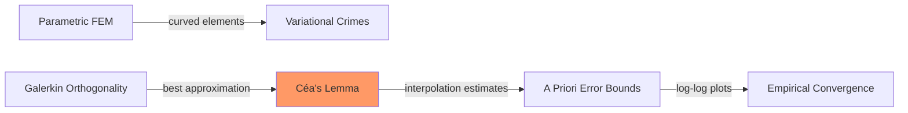

# Week 5 — Parametric FEM & Abstract Error Estimates

**Sections:** §2.8, §3.1–§3.2 | **Chapters 2–3**

---

## Overview

This week bridges FEM implementation with error analysis. [[Parametric-FEM]] generalizes affine elements to curved geometries via polynomial maps — necessary for domains with curved boundaries. The error analysis framework begins with [[Galerkin-Orthogonality]] (the error is $a$-orthogonal to $V_h$), leading to [[Cea-Lemma]] (FEM error $\leq C \cdot$ best approximation error). Empirical convergence experiments show what [[Algebraic-vs-Exponential-Convergence|algebraic and exponential convergence]] ([[Algebraic-vs-Exponential-Convergence]]) look like in practice.

---

## Theory Gist

### §2.8.1 — Affine Equivalence

For straight-edged elements, the affine map $\Phi_K: \hat{K} \to K$ reduces all computations to the reference element $\hat{K}$. The element stiffness matrix has the closed form:

$$\mathbf{A}_K = |\det \mathbf{F}_K|\,\mathbf{F}_K^{-1}\,\hat{\mathbf{A}}\,\mathbf{F}_K^{-T}$$

where $\hat{\mathbf{A}}$ is computed once on $\hat{K}$.

### §2.8.2 — Quadrilateral Lagrangian FE

Bilinear map for quads (tensor-product structure). Even with straight edges, the map is **not affine** — the Jacobian varies over the element.

> [!warning] Quads require quadrature
> Unlike triangles where linear FEM gradients are constant, quadrilateral elements have non-constant Jacobians even for straight edges. Quadrature is always needed.

### §2.8.3 — Transformation Techniques (Lemma 2.8.3.10)

Gradient transformation: $\nabla_{\mathbf{x}} u = \mathbf{F}_K^{-T}\,\nabla_{\hat{\mathbf{x}}}\hat{u}$

Integral transformation: $\int_K g\,\mathrm{d}\mathbf{x} = |\det \mathbf{F}_K|\int_{\hat{K}} g \circ \Phi_K\,\mathrm{d}\hat{\mathbf{x}}$

This is the foundation for all element matrix computation (already used in [[Week-04-FEM-II]]). Rates: [[Formulas-Error-Estimates]].

### §2.8.4 — Boundary Approximation

Isoparametric elements use polynomial maps to approximate curved boundaries. The geometry error from boundary approximation is a [[Variational-Crimes|variational crime]] (§3.5.2).

### §3.1.1–3.1.3 — Abstract Galerkin Error Estimates

Recap: $u$ satisfies $a(u,v) = \ell(v)$, the Galerkin solution $u_h$ satisfies $a(u_h, v_h) = \ell(v_h)$.

> [!theorem] Galerkin Orthogonality
> $$a(u - u_h, v_h) = 0 \qquad \forall v_h \in V_{h,0}$$
> The error $u - u_h$ is $a$-orthogonal to the discrete space. For symmetric $a$: $u_h$ is the exact best approximation in the energy norm.

> [!theorem] Céa's Lemma (Thm 3.1.3.7)
> $$\|u - u_h\|_a \leq \frac{C_a}{\alpha}\,\inf_{v_h \in V_{h,0}} \|u - v_h\|_a$$
> The FEM error is bounded by the best approximation error times $C_a/\alpha$. This separates the PDE problem (existence via [[Lax-Milgram-Theorem]]) from the approximation problem (how well can $V_h$ approximate $u$?).

### §3.1.4 — Refinement

Two strategies to improve approximation: $h$-refinement (finer mesh, fixed $p$) and $p$-refinement (higher degree, fixed mesh). See [[Lagrangian-FEM]].

### §3.2.2 — [[Algebraic-vs-Exponential-Convergence|Algebraic vs Exponential Convergence]] (Def 3.2.2.1)

- **Algebraic:** error $= O(h^p)$ — straight line on log-log plot with slope $p$
- **Exponential:** error $= O(e^{-\beta N^{\gamma}})$ — curve bends downward on log-log plot

Degree-$p$ FEM on uniform meshes typically gives $O(h^p)$ in $H^1$, $O(h^{p+1})$ in $L^2$ for smooth solutions. Corner singularities reduce the rate — see [[Elliptic-Regularity]] (Week 6).

---

## Method Recipes

### Recipe 1: Compute element matrices for parametric elements

1. Map $K$ to reference $\hat{K}$ via $\Phi_K$
2. Compute Jacobian $\mathbf{F}_K(\hat{\mathbf{x}})$ at each quadrature point (non-constant for parametric elements)
3. Transform gradients: $\nabla_{\mathbf{x}} b_i = \mathbf{F}_K^{-T}\nabla_{\hat{\mathbf{x}}}\hat{b}_i$
4. Integrate via quadrature: $(\mathbf{A}_K)_{ij} = \sum_l w_l\,|\det\mathbf{F}_K(\hat{\mathbf{x}}_l)|\,(\mathbf{F}_K^{-T}\nabla\hat{b}_i) \cdot (\mathbf{F}_K^{-T}\nabla\hat{b}_j)$

### Recipe 2: Read convergence from a log-log plot

1. Plot $\|u - u_h\|$ vs $h$ (or $N_{\text{DOF}}$) on log-log axes
2. **Algebraic:** straight line → slope = convergence rate $p$
3. Check: for smooth solution, expect slope $= p$ (FEM degree) in $H^1$-seminorm, $p+1$ in $L^2$
4. If slope $< p$: suspect reduced regularity (corner singularity, non-convex domain)

### Recipe 3: Apply Céa's Lemma to estimate FEM error

1. From [[Lax-Milgram-Theorem]]: identify $C_a$ (continuity) and $\alpha$ (coercivity)
2. Céa bound: $\|u - u_h\|_a \leq (C_a/\alpha)\inf_{v_h}\|u - v_h\|_a$
3. Bound the infimum by choosing $v_h = I_h u$ (the interpolant): $\inf \leq \|u - I_h u\|_a$
4. Apply [[Interpolation-Error-Estimates]] (Week 6) to get explicit rates in $h$

---

## Homework Problems

> [[FEM-Error-Analysis-Problems]] | [[FEM-Extensions-Advanced-Problems]]

| Problem | Title | Code folder | Key skills |
|---------|-------|-------------|------------|
| **3-2** | Debugging Finite Element Codes | `DebuggingFEM` | Code validation via convergence rates |
| **3-15** | Asymptotic Convergence of FE/Interpolation Errors | *(theory)* | Predict rates from Thm 3.3.2.21 |
| **3-19** | Convergence of Finite-Element Solutions | *(theory)* | Identify algebraic vs exponential |
| **3-21** | Asymptotic Convergence of FE Solutions | `AsymptoticCvgFEM` | Empirical rate verification |
| **3-10** | Parametric Finite Elements | `ParametricFiniteElements` | Parametric maps, quadrature |

---

## Exam Problems

> Full bank: [[Exam-Master-Bank#Ch3]] | Hub: [[Exam-Prep-Index]]

| Year | Exam | Problem | Topic | HW / note |
|------|------|---------|-------|-----------|
| **2023** | Final (Summer) | 1-2 | Asymptotic Convergence of Finite-Element Solutions | — AsymptoticCvgFEM; [[Exam-Deep-Convergence-Plots]] |
| **2023** | Endterm | 0-1 | Convergence of Finite-Element Solutions | — [[Exam-Deep-Convergence-Plots]] |
| **2021** | Midterm | 0-2 | Asymptotic Convergence of Finite-Element Discretiz… | — [[Exam-Deep-Convergence-Plots]] |
| **2021** | Final (Summer) | 1-3 | Residual-Based A-Posteriori Error Estimator | — — |
| **2021** | Final (Winter) | 1-1 | Hierarchical Local A-Posteriori Error Estimator | — — |
| **2020** | Final (Winter) | 0-2 | A Local Quasi-Interpolation Operator | — — |
| **2019** | Final (Winter) | 0-3 | Zienkiewicz-Zhu A-Posteriori Error Estimator | — — |
| **2019** | Endterm | 0-1 | Convergence of Finite-Element Galerkin Solutions | — [[Exam-Deep-Convergence-Plots]] |

---

## Connections

| This week | Builds on | Feeds into |
|-----------|-----------|------------|
| Parametric FEM | [[Week-04-FEM-II]] (reference element, [[Local-Computations]]) | [[Week-06-Convergence-and-Accuracy]] ([[Variational-Crimes]] from curved elements) |
| Galerkin orthogonality | [[Week-03-FEM-I]] ([[Galerkin-Discretization]]) | [[Cea-Lemma]], [[A-Priori-FEM-Error-Estimates]] |
| Céa's Lemma | [[Lax-Milgram-Theorem]] (continuity/coercivity) | [[Week-06-Convergence-and-Accuracy]] (interpolation → FEM error) |
| Empirical convergence | [[Lagrangian-FEM]] ($h$-/$p$-refinement) | [[Week-07-Parabolic-IBVPs]] ($h^p$ in Meta-Thm 9.2.8.5) |

> **Note:** Chapters 4–8 and Ch.11 are not covered in the 13 weekly handouts here; related exam problems are listed in [[Exam-Master-Bank]].

---

## Exam Checklist

- [ ] State Galerkin orthogonality and explain its geometric meaning ($a$-orthogonal projection)
- [ ] State Céa's Lemma (Thm 3.1.3.7) and identify constants $C_a$, $\alpha$
- [ ] Explain why Céa reduces FEM error analysis to interpolation error analysis
- [ ] Explain the difference between algebraic and exponential convergence
- [ ] Read convergence rates from log-log plots
- [ ] Describe the gradient transformation for parametric elements (Lemma 2.8.3.10)
- [ ] Explain why curved elements introduce quadrature error (variational crime preview)
