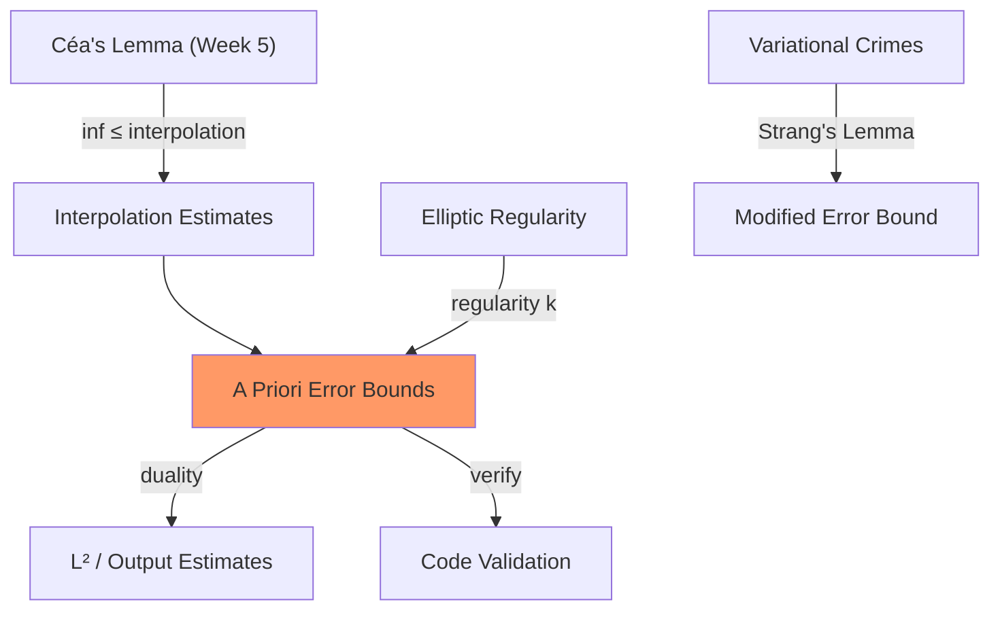

# Week 6 — Convergence & Accuracy of FEM

**Sections:** §3.3–§3.8 | **Chapter 3: FEM Convergence**

---

## Overview

The theoretical backbone of FEM error analysis. [[Interpolation-Error-Estimates]] (how well polynomials approximate smooth functions) combined with [[Cea-Lemma]] (from Week 5) yield [[A-Priori-FEM-Error-Estimates]]. [[Elliptic-Regularity]] determines when solutions are smooth enough for optimal rates. [[Variational-Crimes]] (quadrature error, boundary approximation) add extra error terms via Strang's Lemma. Duality techniques (Aubin-Nitsche) give superconvergence in $L^2$. [[FEM-Code-Validation]] closes the loop.

---

## Theory Gist

### §3.3.1–3.3.2 — Interpolation Error (1D/2D)

> [!theorem] Thm 3.3.2.21 — Interpolation error for piecewise linear FEM in 2D
> On a shape-regular triangulation with mesh width $h_{\mathcal{M}}$, for $u \in H^2(\Omega)$:
> $$|u - I_1 u|_{H^1(\Omega)} \leq C\,h_{\mathcal{M}}\,|u|_{H^2(\Omega)}$$

**Shape regularity (Def 3.3.2.20):** $\rho_{\mathcal{M}} = \max_K \frac{\mathrm{diam}(K)}{\mathrm{diam}(\text{inscribed circle})}$. The constant $C$ depends on $\rho_{\mathcal{M}}$, not on $h$.

> [!warning] Shape regularity matters
> The constant blows up for degenerate (very flat) triangles. Bounded $\rho_{\mathcal{M}}$ means no degenerate elements in the mesh.

### §3.3.3 — Sobolev Scale $H^k$

Higher Sobolev spaces: $u \in H^k(\Omega)$ means $k$ weak derivatives in $L^2$. The regularity index $k$ determines the achievable convergence rate.

### §3.3.5 — General Approximation Estimates

> [!theorem] Thm 3.3.5.6 — Best approximation for degree-$p$ Lagrangian FEM
> For $u \in H^k(\Omega)$, $0 \leq l \leq 1$:
> $$\|u - I_p u\|_{H^l(\Omega)} \leq C\,h_{\mathcal{M}}^{\min(p+1,k)-l}\,|u|_{H^{\min(p+1,k)}(\Omega)}$$

Setting $l = 1$: $H^1$-seminorm error $= O(h^{\min(p, k-1)})$. Setting $l = 0$: $L^2$ error $= O(h^{\min(p+1, k)})$.

### §3.4 — Elliptic Regularity

> [!theorem] Thm 3.4.0.10 — Shift theorem (convex domain)
> Convex polygon $\Omega$, $f \in L^2(\Omega)$: the solution of $-\Delta u = f$ satisfies $u \in H^2(\Omega)$.

Non-convex: re-entrant corner with angle $\omega > \pi$ gives $u \in H^{1+\pi/\omega}$. The **L-shaped domain** ($\omega = 3\pi/2$) has $u \in H^{5/3}$ — linear FEM gives only $O(h^{2/3})$ in $H^1$ instead of $O(h)$.

### §3.5 — Variational Crimes

When $a_h \neq a$ (due to quadrature, boundary approximation), Céa no longer applies directly.

> [!theorem] Strang's Second Lemma (§3.5)
> $$\|u - u_h\| \leq C\!\left(\inf_{v_h}\|u - v_h\| + \sup_{w_h}\frac{|a(v_h,w_h) - a_h(v_h,w_h)|}{\|w_h\|} + \|\ell - \ell_h\|\right)$$
> Three terms: best approximation + bilinear form consistency + load consistency.

- **§3.5.1 — Quadrature impact:** numerical quadrature changes $a$ to $a_h$; controlled if quadrature is accurate enough
- **§3.5.2 — Boundary approximation:** polygonal approximation of curved $\Omega$ introduces geometry error

### §3.6 — Duality Techniques (Aubin-Nitsche)

> [!theorem] Thm 3.6.1.7 — Duality estimate for output functionals
> For a linear functional $J$: $|J(u) - J(u_h)| \leq \|u - u_h\|_a \cdot \|z - z_h\|_a$
> where $z$ solves the dual problem $a(w,z) = J(w)$.

Both factors converge at rate $h^p$ → output functionals converge at rate $h^{2p}$ (double the order!).

**$L^2$ estimate (§3.6.3):** For 2-regular problems: $\|u - u_h\|_{L^2} \leq C\,h\,|u - u_h|_{H^1}$ — the $L^2$ error gains one extra power of $h$ over the $H^1$ error.

### §3.7 — Discrete Maximum Principle (Thm 3.7.2.20)

- **Continuous:** $-\Delta u \geq 0$ in $\Omega$ implies $\max_{\overline{\Omega}} u$ is attained on $\partial\Omega$
- **Discrete:** holds only for **acute triangulations** (all angles $\leq \pi/2$, Delaunay condition)

> [!warning] Obtuse triangles break the discrete maximum principle
> Non-physical oscillations can appear in the FEM solution on meshes with obtuse triangles.

### §3.8 — Code Validation

Validate FEM implementations by checking convergence rates on problems with known exact solutions. If observed rates on log-log plots don't match theoretical predictions → there's a bug. See [[FEM-Code-Validation]].

---

## Method Recipes

### Recipe 1: Predict FEM convergence rate from regularity

1. Determine regularity: $u \in H^k(\Omega)$ (from [[Elliptic-Regularity]])
2. FEM degree $p$: best rate is $\min(p, k-1)$ in $H^1$-seminorm
3. In $L^2$: add 1 (if 2-regular): $\min(p+1, k)$
4. Common case: smooth solution + $p = 1$ → $O(h)$ in $H^1$, $O(h^2)$ in $L^2$

### Recipe 2: Apply Strang's Lemma for variational crimes

1. Identify the crime: is $a_h \neq a$? Is $\ell_h \neq \ell$?
2. For quadrature: estimate $|a(v_h,w_h) - a_h(v_h,w_h)|$ from quadrature error theory
3. For boundary approximation: estimate the geometric error
4. Total error = best approximation + consistency errors from crimes

### Recipe 3: Use Aubin-Nitsche for $L^2$ or output functional errors

1. Define dual problem: $a(w,z) = J(w)\;\forall w$, where $J$ is the target functional
2. Regularity of $z$: if domain is 2-regular, $z \in H^2$
3. Apply: $|J(u) - J(u_h)| \leq \|u - u_h\|_a \cdot \inf\|z - z_h\|_a$
4. Both factors converge at rate $h^p$ → output converges at $h^{2p}$

### Recipe 4: Validate FEM code

1. Choose problem with known exact solution (or manufacture: pick $u$, compute $f = -\Delta u$)
2. Solve on sequence of refined meshes
3. Compute errors in $H^1$-seminorm and $L^2$-norm
4. Plot on log-log, check slopes match predicted rates
5. If rates don't match: check assembly, BCs, quadrature order, regularity

---

## Homework Problems

> [[FEM-Error-Analysis-Problems]] | [[FEM-Extensions-Advanced-Problems]] | [[A-Posteriori-Error-Estimation-Problems]]

| Problem | Title | Code folder | Key skills |
|---------|-------|-------------|------------|
| **3-1** | Computing Averages over the Boundary | — | Output functional, duality convergence |
| **3-5** | Error Estimates for Traces | `ErrorEstimatesForTraces` | Trace interpolation, Céa + trace inequality |
| **3-6** | Projection Onto Constants | — | $L^2$ projection error |
| **3-7** | Maximum Principle for Reaction-Diffusion | `MaximumPrinciple` | Discrete max principle, mesh conditions |
| **3-8** | Output Functionals with Impedance BCs | `OutputImpedanceBVP` | Robin BCs + duality |
| **3-11** | Stable Evaluation at a Point | `StableEvaluationAtAPoint` | Regularized output functional |
| **3-12** | Computation of Electrostatic Forces | `ElectrostaticForce` | Aubin-Nitsche for output |
| **3-13** | Stationary Currents | `StationaryCurrents` | Boundary flux via duality |
| **3-14** | Quasi-Interpolation Operator | `QuasiInterpolation` | Local quasi-interpolation |
| **3-16** | Non-Conforming CR FEM (Theory) | `NonConformingCrouzeixRaviartFiniteElements` | Non-conforming elements Also covered in Week 10 |
| **3-9** | Zienkiewicz-Zhu Error Estimator | `ZienkiewiczZhuEstimator` | A posteriori error estimation |
| **3-17** | Residual-Based Error Estimator | `ResidualErrorEstimator` | A posteriori, residuals + edge jumps |
| **3-18** | Hierarchical Error Estimator | `HierarchicalErrorEstimator` | Local enrichment, a posteriori |

---

## Exam Problems

> Full bank: [[Exam-Master-Bank#Ch3]] | Hub: [[Exam-Prep-Index]]

| Year | Exam | Problem | Topic | HW / note |
|------|------|---------|-------|-----------|
| **2023** | Final (Summer) | 1-2 | Asymptotic Convergence of Finite-Element Solutions | — AsymptoticCvgFEM; [[Exam-Deep-Convergence-Plots]] |
| **2023** | Endterm | 0-1 | Convergence of Finite-Element Solutions | — [[Exam-Deep-Convergence-Plots]] |
| **2021** | Midterm | 0-2 | Asymptotic Convergence of Finite-Element Discretiz… | — [[Exam-Deep-Convergence-Plots]] |
| **2021** | Final (Summer) | 1-3 | Residual-Based A-Posteriori Error Estimator | — — |
| **2021** | Final (Winter) | 1-1 | Hierarchical Local A-Posteriori Error Estimator | — — |
| **2020** | Final (Winter) | 0-2 | A Local Quasi-Interpolation Operator | — — |
| **2019** | Final (Winter) | 0-3 | Zienkiewicz-Zhu A-Posteriori Error Estimator | — — |
| **2019** | Endterm | 0-1 | Convergence of Finite-Element Galerkin Solutions | — [[Exam-Deep-Convergence-Plots]] |

---

## Connections

| This week | Builds on | Feeds into |
|-----------|-----------|------------|
| Interpolation estimates | [[Sobolev-Spaces]], [[Cea-Lemma]] (Week 5) | [[Week-07-Parabolic-IBVPs]] ($h^p$ spatial error in Meta-Thm 9.2.8.5) |
| Elliptic regularity | [[Boundary-Conditions-Elliptic]] (domain geometry) | Predicting convergence degradation on non-convex domains |
| Variational crimes | [[Parametric-FEM]] (Week 5), [[Local-Computations]] | Understanding quadrature error in parametric assembly |
| Duality / Aubin-Nitsche | [[Linear-Variational-Problem]], [[Lax-Milgram-Theorem]] | Boundary flux accuracy, output functionals |
| Code validation | [[Assembly-Algorithm]], [[Essential-BC-Treatment]] | Every coding problem from this point forward |

---

## Exam Checklist

- [ ] State Thm 3.3.5.6 (general approximation) and identify dependence on $h$, $p$, $k$
- [ ] Predict convergence rates for given FEM degree and solution regularity
- [ ] Explain elliptic regularity: convex → $H^2$, re-entrant corner → $H^{1+\pi/\omega}$
- [ ] State Strang's Second Lemma and identify the three error terms
- [ ] Explain the Aubin-Nitsche duality trick for $L^2$ estimates and output functionals
- [ ] Explain why $L^2$ error gains one power of $h$ over $H^1$ (for 2-regular problems)
- [ ] Describe the discrete maximum principle and when it holds (acute triangulations)
- [ ] Validate FEM code: choose exact solution, check rates on log-log plot
