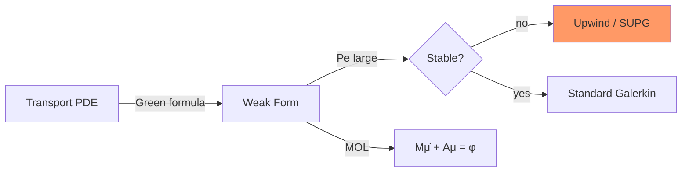

# Week 8 — Convection-Diffusion

**Sections:** §10.1.1–§10.1.4, §10.2.1, §10.2.2–§10.2.2.2, §10.3.1 | **Chapter 10: Convection-Diffusion Problems**

---

## Overview

Stationary and transient transport with diffusion. When convection dominates ($\mathrm{Pe} \gg 1$), standard Galerkin oscillates — need [[Upwind-Quadrature]] or [[Streamline-Diffusion]] (SUPG). Pipeline: [[Convection-Diffusion-Modeling]] → weak form → [[Singular-Perturbation]] / Peclet analysis → stabilization → [[MOL-Convection-Diffusion]] for time-dependent case. Code: [[LehrFEM-Convection-Patterns]]; formulas: [[Formulas-Convection-Diffusion]].

---

## Theory Gist

### §10.1.1–§10.1.4 — Modeling

See [[Convection-Diffusion-Modeling]].

> [!info] Core PDE (stationary)
> $$-\varepsilon\,\Delta u + \mathbf{v}\cdot\nabla u = f \quad \text{in } \Omega$$
> Contrast with [[Heat-Equation]]: diffusion + **advection** along velocity $\mathbf{v}$. Incompressible flow prelude: $\mathrm{div}\,\mathbf{v} = 0$.

Physical origins: charge transport (semiconductors), contaminant transport, fluid mixing. Conservation law $\partial_t u + \mathrm{div}\,\mathbf{j} = 0$ with flux $\mathbf{j} = u\mathbf{v} - \varepsilon\nabla u$.

### §10.2.1 — Singular Perturbation

See [[Singular-Perturbation]].

> [!warning] Peclet instability
> $\mathrm{Pe} = \|\mathbf{v}\|_\infty L / \varepsilon$. For $\mathrm{Pe} \gg 1$: boundary/internal layers, standard Galerkin produces spurious oscillations (pollution).

| Regime | Behavior | FEM strategy |
|--------|----------|--------------|
| $\mathrm{Pe} \lesssim 1$ | Diffusion-dominated | Standard Galerkin OK |
| $\mathrm{Pe} \gg 1$ | Convection-dominated | Upwind or SUPG required |

### §10.2.2.1 — Upwind Quadrature

See [[Upwind-Quadrature]].

> [!theorem] Exam-critical
> Non-symmetric bilinear form: evaluate convection term at **upstream** node per triangle. First-order accurate in layer region; stable for $\varepsilon \to 0$.

Weak form (Dirichlet $u=0$ on $\partial\Omega$):
$$\varepsilon\int_\Omega \nabla u\cdot\nabla v\,\mathrm{d}\mathbf{x} + \int_\Omega (\mathbf{v}\cdot\nabla u)\,v\,\mathrm{d}\mathbf{x} = \int_\Omega f\,v\,\mathrm{d}\mathbf{x}$$

### §10.2.2.2 — Streamline Diffusion (SUPG)

See [[Streamline-Diffusion]].

Add stabilization:
$$\tau_K\int_K (\mathbf{v}\cdot\nabla u_h)(\mathbf{v}\cdot\nabla v_h)\,\mathrm{d}\mathbf{x}$$
with $\tau_K \sim h_K / \|\mathbf{v}\|_K$. Restores stability without excessive numerical diffusion when tuned.

### §10.3.1 — MOL for Convection-Diffusion

See [[MOL-Convection-Diffusion]].

Transient IBVP: same pipeline as Week 7 — spatial Galerkin → $\mathbf{M}\dot{\boldsymbol{\mu}} + \mathbf{A}\boldsymbol{\mu} = \boldsymbol{\varphi}(t)$. Convection matrix $\mathbf{A}$ is **non-symmetric**; advection CFL: explicit methods need $\tau = O(h/\|\mathbf{v}\|)$ (first order in space), not $O(h^2)$.

---

## Method Recipes

### Recipe 1: Derive weak form for convection-diffusion

1. Start with $-\varepsilon\Delta u + \mathbf{v}\cdot\nabla u = f$, BCs $u=g$ on $\Gamma_D$, natural on $\Gamma_N$
2. Multiply by $v \in H_0^1(\Omega)$, integrate over $\Omega$
3. Green's first formula on $-\varepsilon\Delta u$ (reuse Week 2 recipe)
4. Convection term: $\int (\mathbf{v}\cdot\nabla u)\,v$ — no integration by parts if kept in non-conservative form
5. Identify bilinear form $a(u,v)$ and load $\ell(v)$

### Recipe 2: Classify Peclet regime and choose stabilization

1. Compute $\mathrm{Pe} = \|\mathbf{v}\|_\infty L / \varepsilon$
2. $\mathrm{Pe} \lesssim 10$: try standard Galerkin first
3. $\mathrm{Pe} \gg 1$: upwind quadrature (exam) or SUPG (implementation)
4. Check mesh resolution: layer width $\sim \varepsilon/\|\mathbf{v}\|$

### Recipe 3: Assemble convection matrix

1. **Mesh** + `lf::uscalfe::FeSpaceLagrangeO1`
2. Diffusion: `ReactionDiffusionElementMatrixProvider` with $\kappa = \varepsilon$
3. Convection: `ConvBLFMatrixProvider` — see [[LehrFEM-Convection-Patterns]]
4. Upwind: modify quadrature / upstream node selection per triangle
5. SUPG: add element contribution with parameter $\tau_K$

### Recipe 4: Transient MOL setup

1. Assemble $\mathbf{M}$ (mass) and $\mathbf{A}$ (diffusion + convection, possibly stabilized)
2. Implicit Euler or SDIRK from Week 7: $(\mathbf{M}+\tau\mathbf{A})\boldsymbol{\mu}^{(j)} = \mathbf{M}\boldsymbol{\mu}^{(j-1)} + \tau\boldsymbol{\varphi}(t_j)$
3. Non-symmetry: use GMRES or direct LU, not CG

---

## Homework Problems

> [[Convection-Diffusion-Problems]]

| Problem | Title | Code folder | Key skills |
|---------|-------|-------------|------------|
| **10-1** | Exponentially Fitted Upwind Scheme | `ExpFittedUpwind` | Transformation $w=e^{-\Psi}u$, fitted flux |
| **10-2** | Upwind Quadrature Method | `UpwindQuadrature` | Upwind on triangles, Peclet test |
| **10-6** | Streamline Upwind (Pure Advection) | `AdvectionSUPG` | SUPG parameter, 1D/2D |
| **10-7** | SUPG FEM | `SUFEM` | Full stabilization pipeline |
| **10-8** | Upwind Quadrature for Transport | `UpwindQuadrature` | Transport formulation *(exam PDF: `TransportUpwindQuadrature`; distinct from **10-2**)* |
| **2-17** | Convection Bilinear Form | `ConvBLFMatrixProvider` | Assembly only — see [[FEM-Assembly-Implementation-Problems]] |

---

## Exam Problems

> Full bank: [[Exam-Master-Bank#Ch10]] | Hub: [[Exam-Prep-Index]]

| Year | Exam | Problem | Topic | HW / note |
|------|------|---------|-------|-----------|
| **2024** | Midterm | 0-1 | Finite Element Galerkin Discretization of the Conv… | 2-17 ConvectionBilinearForm; [[Exam-Deep-Convection-Upwind]] |
| **2024** | Final (Summer) | 1-1 | Least-squares Galerkin FEM for Scalar Advection-Re… | — LeastSquaresAdvection; [[Exam-Deep-Convection-Upwind]] |
| **2024** | Endterm | 0-2 | Upwind Quadrature Scheme for Transport | 10-8 TransportUpwindQuadrature; [[Exam-Deep-Convection-Upwind]] |
| **2023** | Final (Summer) | 1-3 | Streamline-Upwind Stabilized Finite Element Method | — SUFEM; [[Exam-Deep-Convection-Upwind]] |
| **2022** | Midterm | 0-2 | Galerkin FEM for advection bilinear form | — [[Exam-Deep-Convection-Upwind]] |
| **2022** | Final (Winter) | 1-1 | Streamline Upwind Method for Pure Advection Proble… | 10-6 AdvectionSUPG; [[Exam-Deep-Convection-Upwind]] |
| **2021** | Midterm | 0-3 | Local Computations for Convection Bilinear Form | — [[Exam-Deep-Convection-Upwind]] |
| **2019** | Midterm | 0-4 | Linear finite element Galerkin discretization of 1… | — [[Exam-Deep-Convection-Upwind]] |

---

## Connections

| This week | Builds on | Feeds into |
|-----------|-----------|------------|
| Convection-diffusion | [[Week-07-Parabolic-IBVPs]], [[Heat-Equation]] | [[Week-09-Stokes-I]] (fluid modeling) |
| Weak form / assembly | [[Week-02-Elliptic-BVPs-II]], [[Week-03-FEM-I]], [[Week-04-FEM-II]] | Week 11+ (transport out of scope) |
| MOL transient | [[Method-of-Lines]], [[Timestepping-MOL]] | — |
| Non-symmetric systems | [[Galerkin-Discretization]] | [[Stokes-Saddle-Point]] (Week 9) |

---

## Exam Checklist

- [ ] Derive weak form for $-\varepsilon\Delta u + \mathbf{v}\cdot\nabla u = f$ with given BCs
- [ ] Define Peclet number; explain why Galerkin fails for $\mathrm{Pe} \gg 1$
- [ ] Describe upwind quadrature on a triangle (upstream node)
- [ ] Write SUPG stabilization term and choose $\tau_K$ scaling
- [ ] Set up MOL ODE with non-symmetric $\mathbf{A}$; state CFL for explicit advection
- [ ] Assemble convection via `ConvBLFMatrixProvider` (Problem 2-17)
