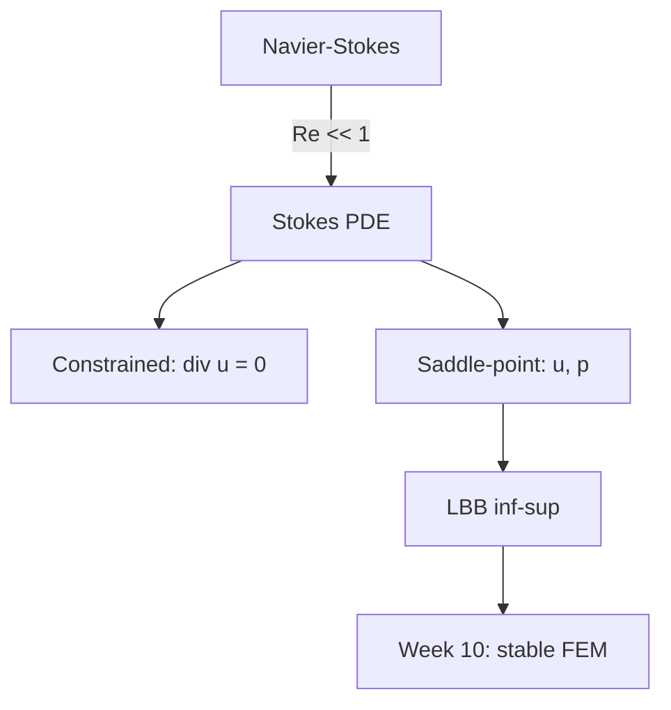

# Week 9 — Stokes Equations I

**Sections:** §12.1, §12.2.1–§12.2.3 | **Chapter 12: Finite Elements for the Stokes Equation (theory)**

---

## Overview

Viscous incompressible flow → Stokes limit (low Reynolds number). Two continuous formulations: [[Stokes-Constrained-Variational]] (divergence-free velocity only) vs [[Stokes-Saddle-Point]] (velocity + pressure). [[LBB-Condition]] (Thm 12.2.2.23) is the solvability condition for the mixed problem. FEM implementation in [[Week-10-Stokes-II]]. Formulas: [[Formulas-Stokes]].

---

## Theory Gist

### §12.1 — Modeling

See [[Stokes-Modeling]].

> [!info] Stokes system (strong form)
> $$-\mu\,\Delta\mathbf{u} + \nabla p = \mathbf{f}, \qquad \mathrm{div}\,\mathbf{u} = 0 \quad \text{in } \Omega$$
> Reynolds number $\mathrm{Re} = \rho U L / \mu$. Stokes limit: $\mathrm{Re} \ll 1$ (creeping flow). Links to [[Week-08-Convection-Diffusion]] fluid modeling; incompressible prelude $\mathrm{div}\,\mathbf{v} = 0$.

### §12.2.1 — Constrained Variational Formulation

See [[Stokes-Constrained-Variational]].

Find $\mathbf{u} \in V := \{\mathbf{v} \in H_0^1(\Omega)^d : \mathrm{div}\,\mathbf{v} = 0\}$ such that
$$a(\mathbf{u}, \mathbf{v}) = \ell(\mathbf{v}) \quad \forall \mathbf{v} \in V$$
with $a(\mathbf{u},\mathbf{v}) = \int_\Omega \mu\, D\mathbf{u} : D\mathbf{v}\,\mathrm{d}\mathbf{x}$ (symmetric gradient $D\mathbf{u}$).

> [!tip] Hard to discretize directly
> Enforcing $\mathrm{div}\,\mathbf{u}_h = 0$ exactly on a mesh is difficult → saddle-point formulation with pressure as Lagrange multiplier.

### §12.2.2–§12.2.3 — Saddle-Point Formulation

See [[Stokes-Saddle-Point]].

Find $(\mathbf{u}, p) \in H_0^1(\Omega)^d \times L^2(\Omega)$ (pressure unique up to constant; pin with $\int_\Omega p = 0$):
$$\begin{cases} a(\mathbf{u}, \mathbf{v}) + b(\mathbf{v}, p) = \ell(\mathbf{v}) & \forall \mathbf{v} \in H_0^1(\Omega)^d \\ b(\mathbf{u}, q) = 0 & \forall q \in L^2(\Omega) \end{cases}$$
with $b(\mathbf{v}, q) = -\int_\Omega q\,\mathrm{div}\,\mathbf{v}\,\mathrm{d}\mathbf{x}$.

Block form:
$$\begin{pmatrix} \mathbf{A} & \mathbf{B}^T \\ \mathbf{B} & \mathbf{0} \end{pmatrix} \begin{pmatrix} \boldsymbol{\mu}_u \\ \boldsymbol{\mu}_p \end{pmatrix} = \begin{pmatrix} \boldsymbol{\varphi} \\ \mathbf{0} \end{pmatrix}$$

### LBB Condition (Thm 12.2.2.23)

See [[LBB-Condition]].

> [!theorem] Ladyzhenskaya–Babuška–Brezzi
> **LBB1 (coercivity):** $a(\mathbf{v},\mathbf{v}) \geq \alpha \|\mathbf{v}\|_{H^1}^2$ on $\ker B$.
> **LBB2 (inf-sup):** $\displaystyle\inf_{q \in L^2} \sup_{\mathbf{v} \in H_0^1} \frac{b(\mathbf{v},q)}{\|\mathbf{v}\|_{H^1}\|q\|_{L^2}} \geq \beta > 0$.

LBB2 ensures pressure controls velocity divergence — without it, pressure is undetermined. Discrete LBB required for stable FEM ([[Week-10-Stokes-II]]).

---

## Method Recipes

### Recipe 1: Derive saddle-point form from strong Stokes + BCs

1. Multiply momentum equation by test $\mathbf{v} \in H_0^1(\Omega)^d$, integrate
2. Integration by parts on $-\mu\Delta\mathbf{u}$ → viscous term $a(\mathbf{u},\mathbf{v})$
3. Pressure term: $\int \nabla p \cdot \mathbf{v} = -\int p\,\mathrm{div}\,\mathbf{v}$ (if boundary terms vanish)
4. Incompressibility as constraint: $b(\mathbf{u}, q) = 0$ for all $q$

### Recipe 2: Check LBB2 (intuitive)

Pressure gradient must be controlled by velocity: for any $q$, exists $\mathbf{v}$ with $\mathrm{div}\,\mathbf{v} \approx q$ and $\|\mathbf{v}\|_{H^1} \lesssim \|q\|_{L^2}$. Failure → spurious pressure modes in naive FEM.

### Recipe 3: Relate constrained vs saddle-point

Pressure $p$ is the Lagrange multiplier enforcing $\mathrm{div}\,\mathbf{u} = 0$. Constrained space $V$ is the kernel of $B$; saddle-point enlarges search space then penalizes divergence.

---

## Homework Problems

> [[Stokes-Problems]]

| Problem | Title | Code folder | Key skills |
|---------|-------|-------------|------------|
| **12-4** | FEM for Stokes BVPs | *(theory-heavy)* | Block system, $a$, $b$ — theory-heavy |
| **12-1** | Taylor-Hood Pipe Flow | `StokesPipeFlow` | Full implementation — **Week 10** |
| **12-3** | Taylor-Hood BVP | `TaylorHoodNonMonolithic` | Convergence — **Week 10** |

---

## Exam Problems

> Full course bank: [[Exam-Master-Bank#Ch12]] | Full course: [[Exam-Prep-Index]] | Endterm prep: [[Endterm-Prep-Ch9-Ch12]]

| Year | Exam | Problem | Topic | HW / note |
|------|------|---------|-------|-----------|
| **2025** | Final (Summer) | 1-2 | Stabilized P1-FEM for Stokes | 12-5 StokesStabP1FEM; [[Exam-Deep-Stokes-Mixed]] |
| **2025** | Endterm | 0-1 | FEM for Stokes BVPs | 12-4 StokesVPFEM; [[Exam-Deep-Stokes-Mixed]] |
| **2024** | Final (Summer) | 1-3 | Implementing the Taylor-Hood Finite Element Method… | 12-3 TaylorHoodNonMonolithic; [[Exam-Deep-Stokes-Mixed]] |
| **2024** | Final (Winter) | 1-3 | The MINI Element for Stokes | 12-2 StokesMINIElement; [[Exam-Deep-Stokes-Mixed]] |

---

## Connections

| This week | Builds on | Feeds into |
|-----------|-----------|------------|
| Stokes modeling | [[Week-08-Convection-Diffusion]], incompressible flow | [[Week-10-Stokes-II]] |
| Saddle-point theory | [[Linear-Variational-Problem]], [[Lax-Milgram-Theorem]] | [[Pressure-Instability]], [[Taylor-Hood-FEM]] |
| Inf-sup | Coercivity (Week 1–2) | [[Week-13-FEEC-Magnetostatics]] (discrete LBB) |

---

## Exam Checklist

- [ ] Write strong Stokes system + physical meaning of $\mathrm{Re}$
- [ ] Derive saddle-point weak form; identify $a$, $b$, $\ell$
- [ ] State LBB1 and LBB2; explain role of inf-sup on pressure
- [ ] Write block matrix system for discrete $(\mathbf{u}_h, p_h)$
- [ ] Explain why constrained formulation is hard to discretize
- [ ] Relate pressure to Lagrange multiplier for $\mathrm{div}\,\mathbf{u} = 0$
