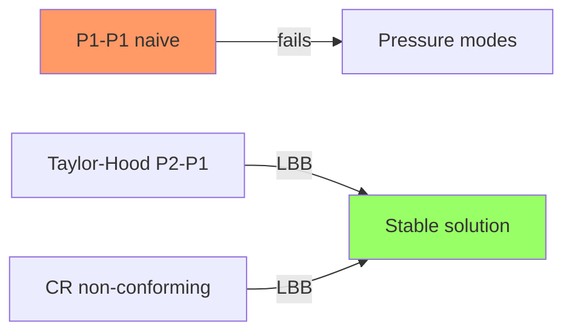

# Week 10 — Stokes FEM

**Sections:** §12.3.1–§12.3.5 | **Chapter 12: Finite Elements for the Stokes Equation (discretization)**

---

## Overview

Naive equal-order $P_1$–$P_1$ FEM → [[Pressure-Instability]] (spurious pressure modes). Stable mixed methods: [[Taylor-Hood-FEM]] ($P_2$ velocity / $P_1$ pressure) and [[Crouzeix-Raviart-FEM]] (non-conforming $P_1$ velocity). Convergence under discrete LBB links to [[Cea-Lemma]] and [[A-Priori-FEM-Error-Estimates]]. Code: [[LehrFEM-Stokes-Patterns]]; problems: [[Stokes-Problems]].

---

## Theory Gist

### §12.3.1 — Pressure Instability

See [[Pressure-Instability]].

> [!warning] Equal-order $P_1$–$P_1$ fails
> Discrete kernel of $B_h$ contains spurious pressure modes (checkerboard oscillations). $\mathrm{div}\,\mathbf{u}_h \not\perp$ spurious $q_h$.

### §12.3.2 — Stable Galerkin + Discrete LBB

Discrete inf-sup must hold on chosen mixed spaces $V_h \times Q_h$:
$$\inf_{q_h \in Q_h} \sup_{\mathbf{v}_h \in V_h} \frac{b(\mathbf{v}_h, q_h)}{\|\mathbf{v}_h\|_{H^1}\|q_h\|_{L^2}} \geq \beta_h > 0$$

### §12.3.3 — Convergence

Under LBB + regularity: $\|\mathbf{u} - \mathbf{u}_h\|_{H^1} = O(h^2)$, $\|p - p_h\|_{L^2} = O(h^2)$ for Taylor-Hood on smooth problems. See [[Cea-Lemma]], [[A-Priori-FEM-Error-Estimates]].

### §12.3.4 — Taylor-Hood FEM

See [[Taylor-Hood-FEM]].

> [!theorem] Exam-critical
> Velocity $P_2$ (or $P_2^d$ vector), pressure $P_1$. Local DOFs on triangle: 6 velocity + 3 pressure per component pair → stable.

### §12.3.5 — Crouzeix–Raviart FEM

See [[Crouzeix-Raviart-FEM]].

Non-conforming $P_1$ velocity at edge midpoints + $P_1$ pressure. Preview from Week 4 [[Lagrangian-FEM]]; assembly problems **2-14**, **3-16**.

---

## Method Recipes

### Recipe 1: Write block Galerkin system

1. Choose spaces: $V_h$ (velocity), $Q_h$ (pressure)
2. Assemble $\mathbf{A}$ from $a(\cdot,\cdot)$, $\mathbf{B}$ from $b(\cdot,\cdot)$
3. Solve $\begin{pmatrix}\mathbf{A} & \mathbf{B}^T \\ \mathbf{B} & \mathbf{0}\end{pmatrix} \mathbf{x} = \mathbf{b}$
4. Pin pressure: one DOF or $\int_\Omega p_h = 0$

### Recipe 2: Taylor-Hood local DOF count (triangle)

- $P_2$ scalar: 6 DOFs (3 vertices + 3 edge midpoints)
- $P_1$ scalar: 3 DOFs (vertices)
- Vector velocity in 2D: $2 \times 6 = 12$ velocity DOFs per element block

### Recipe 3: Implement in LehrFEM++

See [[LehrFEM-Stokes-Patterns]].

1. `lf::uscalfe::FeSpaceLagrangeO2` for velocity, `lf::uscalfe::FeSpaceLagrangeO1` for pressure
2. Separate assembly passes for viscous block and divergence block
3. Block solver: Schur complement, monolithic LU, or Uzawa iteration
4. Pressure null-space: fix one pressure DOF

### Recipe 4: Connect CR element to Week 4

- CR velocity: edge DOFs, broken gradients
- Problems **2-14** (CR Laplacian), **3-16** (non-conforming error) — same infrastructure as Stokes CR

---

## Homework Problems

> [[Stokes-Problems]]

| Problem | Title | Code folder | Key skills |
|---------|-------|-------------|------------|
| **12-1** | Taylor-Hood Pipe Flow | `StokesPipeFlow` | Full 2D simulation, VTK Also listed in Week 9 |
| **12-2** | MINI Element | `StokesMINIElement` | Bubble enrichment |
| **12-3** | Taylor-Hood BVP | `TaylorHoodNonMonolithic` | Convergence rates Also listed in Week 9 |
| **12-5** | Stabilized $P_1$–$P_1$ | `StokesStabP1FEM` | Penalty stabilization |
| **2-14** | CR Laplacian | — | Non-conforming preview |
| **3-16** | CR error analysis | — | Non-conforming norms |

---

## Exam Problems

> Full course bank: [[Exam-Master-Bank#Ch12]] | Full course: [[Exam-Prep-Index]] | Endterm prep: [[Endterm-Prep-Ch9-Ch12]]

| Year | Exam | Problem | Topic | HW / note |
|------|------|---------|-------|-----------|
| **2025** | Final (Summer) | 1-2 | Stabilized P1-FEM for Stokes | 12-5 StokesStabP1FEM; [[Exam-Deep-Stokes-Mixed]] |
| **2025** | Endterm | 0-1 | FEM for Stokes BVPs | 12-4 StokesVPFEM; [[Exam-Deep-Stokes-Mixed]] |
| **2024** | Final (Summer) | 1-3 | Implementing the Taylor-Hood Finite Element Method… | 12-3 TaylorHoodNonMonolithic; [[Exam-Deep-Stokes-Mixed]] |
| **2024** | Final (Winter) | 1-3 | The MINI Element for Stokes | 12-2 StokesMINIElement; [[Exam-Deep-Stokes-Mixed]] |

---

## Connections

| This week | Builds on | Feeds into |
|-----------|-----------|------------|
| Stable Stokes FEM | [[Week-09-Stokes-I]], [[LBB-Condition]] | [[Week-13-FEEC-Magnetostatics]] |
| Assembly | [[Week-04-FEM-II]], [[Assembly-Algorithm]] | [[LehrFEM-Stokes-Patterns]] |
| Error analysis | [[Week-06-Convergence-and-Accuracy]] | Mixed FEM theory |
| CR element | [[Lagrangian-FEM]], problems 2-14, 3-16 | [[Crouzeix-Raviart-FEM]] |

---

## Exam Checklist

- [ ] Explain why $P_1$–$P_1$ Stokes fails (spurious pressure modes)
- [ ] State discrete LBB; name a stable element pair (Taylor-Hood, MINI, CR)
- [ ] Write block system $(\mathbf{A}, \mathbf{B}^T; \mathbf{B}, \mathbf{0})$ for $(\mathbf{u}_h, p_h)$
- [ ] Count Taylor-Hood DOFs on a triangle
- [ ] Sketch assembly: separate velocity and pressure spaces
- [ ] State convergence rates for Taylor-Hood under smooth solution
