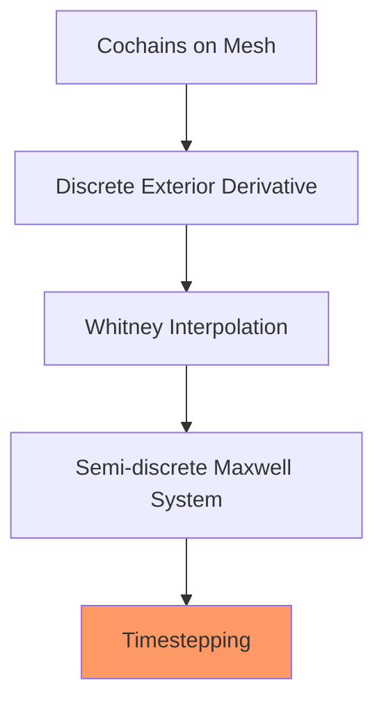

# Week 12 — FEEC II: Cochains, Whitney Forms, EM Waves

**Sections:** §13.2.1–§13.2.2, §13.3.2.1–§13.3.2.3 | **Chapter 13: Discrete forms and wave evolutions**

---

## Overview

Week 12 discretizes Chapter 13 structure: [[Cochain-Calculus]] and [[Discrete-Exterior-Derivative]] give topological operators; [[Whitney-Forms]] provide compatible finite element spaces; [[Electromagnetic-Wave-Equations]] connects this to evolution models. This extends [[Method-of-Lines]] from Week 7 to Maxwell systems. Code: [[LehrFEM-FEEC-Patterns]]; formulas: [[Formulas-Exterior-Calculus]].

---

## Theory Gist

### §13.2.1 — Cochain calculus

See [[Cochain-Calculus]] and [[Discrete-Exterior-Derivative]].

Discrete operators are incidence matrices with exactness:
$$\mathbf D_{\ell+1}\mathbf D_\ell=0.$$

### §13.2.2 — Whitney forms

See [[Whitney-Forms]].

Whitney spaces are the FE realization of differential-form degrees and satisfy commuting properties with derivatives.

> [!theorem] Commuting property
> Interpolation and exterior derivative commute, which preserves algebraic structure in the Galerkin discretization.

### §13.3.2.1 — Electromagnetic wave equations

See [[Electromagnetic-Wave-Equations]].

Variational Maxwell evolution resembles wave dynamics from Week 7, but in compatible $H(\mathrm{curl})/H(\mathrm{div})$-type spaces.

### §13.3.2.2–§13.3.2.3 — MOL and timestepping

Semi-discretization yields coupled matrix ODE systems. Timestepping requires robust handling of non-diagonal mass/coupling blocks; implicit methods are typical.

> [!tip] Week-7 analogy
> Pipeline is still: spatial variational form → matrix ODE → timestepping; only spaces/operators change.

---

## Method Recipes

### Recipe 1: Build cochain operators from mesh

1. Fix consistent orientations for edges/faces
2. Assemble incidence matrices between facet levels
3. Verify $\mathbf D_{\ell+1}\mathbf D_\ell=0$

### Recipe 2: Choose Whitney spaces by field degree

1. Map each unknown to form degree
2. Pick matching Whitney space (0,1,2)
3. Confirm derivative maps space-to-space compatibility

### Recipe 3: Derive semi-discrete Maxwell system

1. Start from variational wave formulation
2. Insert Whitney bases and test functions
3. Obtain coupled mass/curl matrix system
4. Select stable timestepping (implicit/structure-preserving)

### Recipe 4: Constraint propagation sanity check

1. Identify continuous constraints
2. Write discrete counterpart through incidence operators
3. Verify constraints are propagated by time update

---

## Homework Problems

> [[FEEC-EM-Waves-Problems]]

| Problem | Title | Code folder | Key skills |
|---------|-------|-------------|------------|
| **13-1** | Incidence Matrices of a 2D Finite Element Mesh | `IncidenceMatrices` | Also introduced in Week 11 |
| **13-4** | TM-Mode Electromagnetic Wave Equation | `MaxwellEvlTM` | Variational wave model, FEEC MOL |

---

## Exam Problems

> Full bank: [[Exam-Master-Bank#Ch13]] | Hub: [[Exam-Prep-Index]]

| Year | Exam | Problem | Topic | HW / note |
|------|------|---------|-------|-----------|
| **2025** | Final (Summer) | 1-3 | Whitney Finite Elements for Magnetostatic BVP in T… | 13-3 MagStat2D; [[Exam-Deep-FEEC-Maxwell]] |
| **2025** | Final (Winter) | 1-3 | TM-Mode Electromagnetic Wave Equation | 13-4 MaxwellEvlTM; [[Exam-Deep-FEEC-Maxwell]] |

---

## Connections

| This week | Builds on | Feeds into |
|-----------|-----------|------------|
| Discrete forms | [[Week-11-FEEC-I]] | [[Week-13-FEEC-Magnetostatics]] |
| Maxwell MOL | [[Week-07-Parabolic-IBVPs]], [[Method-of-Lines]], [[Timestepping-MOL]] | EM and magnetostatics implementations |
| Compatible FE spaces | [[Week-04-FEM-II]], [[Assembly-Algorithm]] | [[LehrFEM-FEEC-Patterns]] |

---

## Exam Checklist

- [ ] Define cochains and discrete exterior derivative
- [ ] Explain why incidence matrices encode topology only
- [ ] Describe Whitney forms as global shape functions by facet degree
- [ ] State commuting interpolation/derivative principle
- [ ] Write the semi-discrete EM wave matrix system (qualitative structure)
- [ ] Relate FEEC MOL pipeline to Week 7 method-of-lines
