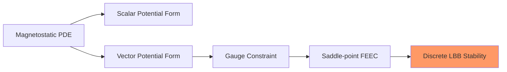

# Week 13 — FEEC Magnetostatics

**Sections:** §13.3.3.1–§13.3.3.4 | **Chapter 13: Magnetostatic formulations and stable discretization**

---

## Overview

Chapter 13 culminates in magnetostatics: scalar-potential and vector-potential formulations, then a stable mixed form with discrete inf-sup. Key cards: [[Magnetostatics-Scalar-Potential]], [[Magnetostatics-Vector-Potential]], [[Magnetostatics-Saddle-Point-LBB]]. This closes the LBB arc started in [[Week-09-Stokes-I]] and [[Week-10-Stokes-II]]. Code: [[LehrFEM-FEEC-Patterns]]; formulas: [[Formulas-Exterior-Calculus]].

---

## Theory Gist

### §13.3.3.1 — Scalar-potential magnetostatics

See [[Magnetostatics-Scalar-Potential]].

Provides an elliptic baseline model when assumptions allow potential representation.

### §13.3.3.2 — Vector-potential formulation

See [[Magnetostatics-Vector-Potential]].

Set $b=d^1a$ (vector proxy: $b=\mathrm{curl}\,a$). Natural FE spaces are Whitney 1-forms.

> [!warning] Gauge freedom
> $a$ is non-unique up to gradient fields, so constraints or mixed formulations are required.

### §13.3.3.3 — Saddle-point variational problem

See [[Magnetostatics-Saddle-Point-LBB]].

Mixed block structure is analogous to Stokes:
$$\begin{pmatrix}A & B^T \\ B & 0\end{pmatrix}.$$

### §13.3.3.4 — Discrete LBB conditions

Discrete FEEC stability needs:
- ellipticity on $\ker B$,
- inf-sup bound for $B$.

> [!theorem] Structural parallel to Stokes
> LBB is the common stability mechanism for both incompressible flow and gauge-constrained magnetostatics.

---

## Method Recipes

### Recipe 1: Choose potential formulation

1. Check geometry/source assumptions
2. Use scalar potential when admissible for simpler elliptic solve
3. Switch to vector/mixed form for full FEEC-compatible structure

### Recipe 2: Build mixed magnetostatics block system

1. Assemble $A$ from curl/material terms
2. Assemble constraint coupling $B$
3. Enforce gauge/constraint in block solve
4. Validate null-space handling

### Recipe 3: Verify discrete LBB in practice

1. Check compatibility of chosen Whitney spaces
2. Inspect spectrum/kernel behavior of block matrix
3. Confirm no spurious gauge modes in refinement studies

### Recipe 4: Reuse Stokes intuition

Map:
- pressure constraint in Stokes ↔ gauge constraint here,
- Stokes inf-sup ↔ magnetostatics inf-sup.

---

## Homework Problems

> [[Magnetostatics-Problems]]

| Problem | Title | Code folder | Key skills |
|---------|-------|-------------|------------|
| **13-2** | Mixed FEM for the 2D Hodge-Laplacian | `HodgeLaplacian2D` | Mixed FEEC formulation |
| **13-3** | Whitney FE for Magnetostatic BVP in 2D | `MagStat2D` | Potentials, gauge, discrete LBB |

---

## Exam Problems

> Full bank: [[Exam-Master-Bank#Ch13]] | Hub: [[Exam-Prep-Index]]

| Year | Exam | Problem | Topic | HW / note |
|------|------|---------|-------|-----------|
| **2025** | Final (Summer) | 1-3 | Whitney Finite Elements for Magnetostatic BVP in T… | 13-3 MagStat2D; [[Exam-Deep-FEEC-Maxwell]] |
| **2025** | Final (Winter) | 1-3 | TM-Mode Electromagnetic Wave Equation | 13-4 MaxwellEvlTM; [[Exam-Deep-FEEC-Maxwell]] |

---

## Connections

| This week | Builds on | Feeds into |
|-----------|-----------|------------|
| Magnetostatics potentials | [[Week-11-FEEC-I]], [[Week-12-FEEC-II-and-EM-Waves]] | Advanced computational electromagnetics |
| Saddle-point stability | [[Week-09-Stokes-I]], [[Week-10-Stokes-II]], [[LBB-Condition]] | Mixed FE research/implementations |
| Whitney discretization | [[Whitney-Forms]], [[LehrFEM-FEEC-Patterns]] | Structure-preserving CEM workflows |

---

## Exam Checklist

- [ ] Distinguish scalar- vs vector-potential magnetostatics formulations
- [ ] Explain gauge freedom and why a mixed constraint is needed
- [ ] Write block saddle-point structure for A-based formulation
- [ ] State LBB1/LBB2 interpretation for magnetostatics
- [ ] Explain why Whitney spaces support stable discretization
- [ ] Relate magnetostatics mixed stability to Stokes mixed FEM
